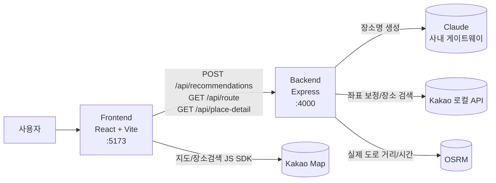

# 틈나는 시간 여행 추천 웹앱

현재 위치(GPS) 또는 지정 위치와 틈나는 시간을 입력받아, 그 시간 안에 다녀올 수 있는 여행 장소를 추천하는 웹 서비스입니다. LLM(Claude)으로 조건에 맞는 장소를 생성하고, 카카오 로컬 검색으로 실제 좌표를 보정하며, 지도에 경로와 이동시간을 시각화합니다.

## 저장소 구조

- `frontend/` — React + TypeScript + Vite 프론트엔드 (입력 화면, 결과 목록, 카카오 지도, 상세 모달)
- `backend/` — Node.js + Express + TypeScript API 서버 (LLM 추천, 경로 조회, 장소 상세)
- `docs/` — 기획/작업 문서 (제품 요구사항, 작업 체크리스트, planning, devlog, 진행 대시보드)
- `scripts/` — 개발 서버 관리 스크립트
- `tests/e2e/` — Playwright 기반 E2E 테스트

## 아키텍처 개요



- 추천 로직은 **백엔드**에서 처리합니다. Claude 키가 있으면 LLM 추천, 없거나 실패하면 규칙 기반(거리/시간)으로 폴백합니다.
- Claude는 장소명만 생성하고, 실제 좌표는 카카오 로컬 검색으로 보정합니다.
- 프론트의 `VITE_API_BASE_URL` 이 비어 있으면 백엔드 없이 Mock 데이터로 동작합니다.

## 빠른 실행 (스크립트 권장)

프론트엔드와 백엔드를 백그라운드에서 함께 시작/중지/재시작할 수 있습니다.

```bash
./scripts/dev-server.sh start           # 프론트(:5173) + 백엔드(:4000) 모두 시작
./scripts/dev-server.sh start front     # 프론트만 시작
./scripts/dev-server.sh start back      # 백엔드만 시작
./scripts/dev-server.sh stop            # 모두 중지
./scripts/dev-server.sh restart         # 재시작
./scripts/dev-server.sh status          # 실행 여부 확인
./scripts/dev-server.sh logs back       # 백엔드 로그 실시간 확인 (Ctrl+C로 종료)
```

- 두 번째 인자를 생략하면 `all`(프론트+백엔드)이 대상입니다.
- PID/로그는 `.run/` 에 저장되며 Git 에서 제외됩니다. (로그: `.run/dev-front.log`, `.run/dev-back.log`)
- 의존성이 없으면 시작 시 `npm install` 을 자동 실행합니다.

## 수동 실행

### 프론트엔드

```bash
cd frontend
npm install
npm run dev   # http://localhost:5173/
```

- 환경변수는 `frontend/.env.example` 참고 (`.env` 로 복사해 사용, 키는 커밋 금지)
- `VITE_API_BASE_URL` 이 비어 있으면 Mock 추천 데이터로 동작합니다.
- `VITE_KAKAO_MAP_KEY` 가 있어야 지도가 표시됩니다. 없으면 목록만 동작합니다.
  카카오 개발자 콘솔에서 앱의 Web 플랫폼 도메인에 `http://localhost:5173` 을 등록해야 합니다.

### 백엔드

```bash
cd backend
npm install
cp .env.example .env   # 필요 시 값 수정
npm run dev            # http://localhost:4000/
```

- 환경변수는 `backend/.env.example` 참고. Claude/카카오 REST 키는 반드시 **백엔드**에만 둡니다.
- 자세한 내용은 [backend/README.md](backend/README.md) 참고.

## 문서

- 제품 요구사항 (무엇을·왜): [docs/product-requirements.md](docs/product-requirements.md)
- 작업 체크리스트 (어디까지): [docs/task-checklist.md](docs/task-checklist.md)
- 진행 대시보드: [docs/dashboard/index.html](docs/dashboard/index.html)
- 개발 로그: [docs/devlog/](docs/devlog/)
- 팀 공유 지식/컨벤션: [AGENTS.md](AGENTS.md)