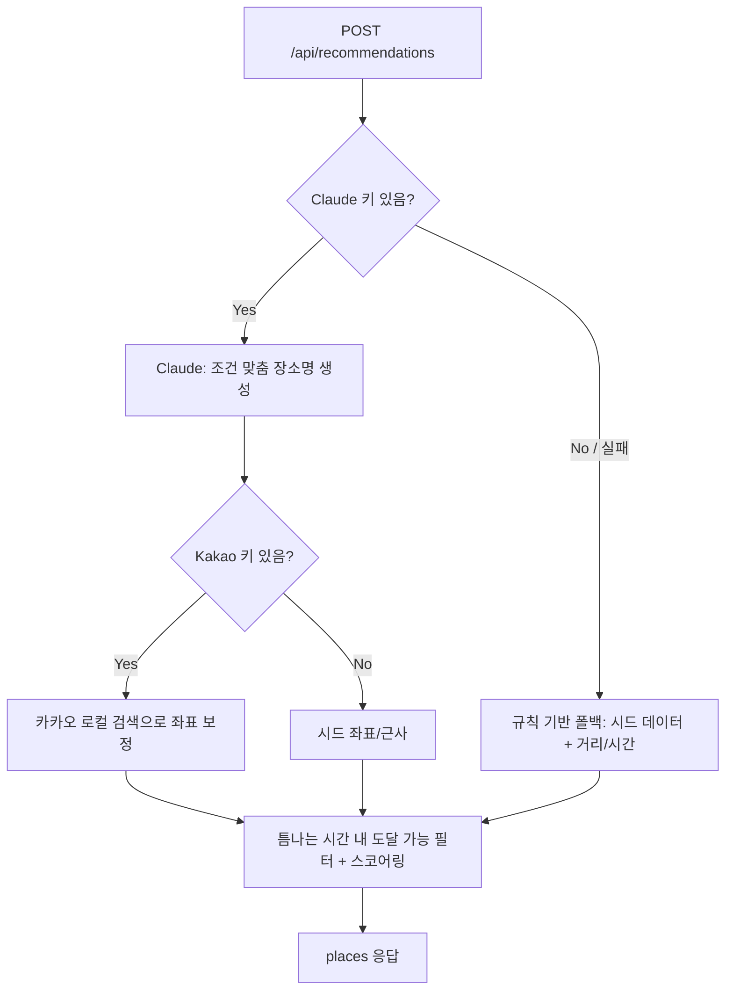

# Backend — 틈나는 시간 여행 추천 API

Node.js + Express + TypeScript(ESM) 기반 추천 API 서버. LLM(Claude)으로 조건에 맞는 장소명을 생성하고, 카카오 로컬 검색으로 실제 좌표를 보정하며, OSRM으로 실제 도로 거리·시간을 보정한다.

## 실행

```bash
npm install
cp .env.example .env   # 필요 시 값 수정
npm run dev            # 개발 (tsx watch)
```

빌드 후 실행:

```bash
npm run build
npm start
npm run typecheck      # 타입 체크만 (빌드 산출물 없음)
```

## 환경변수

| 변수 | 기본값 | 설명 |
|------|--------|------|
| `PORT` | 4000 | 서버 포트 |
| `CORS_ORIGIN` | (전체 허용) | 허용 오리진, 쉼표 구분 |
| `KAKAO_REST_API_KEY` | - | (선택) 카카오 로컬 검색 — LLM 생성 장소명의 실제 좌표 보정 |
| `ANTHROPIC_API_KEY` | - | (선택) Claude 키. 미설정 시 규칙 기반(거리/시간) 추천으로 폴백 |
| `ANTHROPIC_BASE_URL` | `https://api.anthropic.com/v1` | (선택) 사내 LLM 게이트웨이 Base URL (OpenAI 호환) |
| `ANTHROPIC_MODEL` | `claude-haiku-4.5` | (선택) 사용할 모델. 게이트웨이 지원 모델명 사용 |
| `OSRM_BASE_URL` | `https://router.project-osrm.org` | (선택) OSRM route API. 도보/자동차 실제 도로 거리·시간 보정 |

> **주의**: 사내 LLM 게이트웨이는 **OpenAI 호환** 형식이다. Anthropic 네이티브 SDK(`/v1/messages` + `x-api-key`)가 아니라 `POST {BASE_URL}/chat/completions` + `Authorization: Bearer` 로 호출한다. 정식 Anthropic 모델명(`claude-3-5-*`)은 게이트웨이에서 404가 날 수 있으므로 게이트웨이가 지원하는 모델명을 사용한다.

## 추천 처리 흐름



## API

### `GET /health`

```json
{ "status": "ok" }
```

### `POST /api/recommendations`

틈나는 시간 여행 추천. 요청/응답/에러 규격은 [docs/product-requirements.md — 3. API 계약](../docs/product-requirements.md#3-api-계약-contract--병렬-작업의-기준) 기준.

요청 예:

```json
{
  "location": { "lat": 37.5665, "lng": 126.978 },
  "availableMinutes": 90,
  "mode": "driving",
  "tags": ["cafe", "nature"],
  "tripType": "roundtrip"
}
```

### `GET /api/route`

두 지점 간 경로(지도용 좌표 목록)와 실제(또는 추정) 소요시간·거리를 반환한다.

- 쿼리: `origin=lat,lng`, `destination=lat,lng`, `mode=walking|transit|driving`
- `driving`: OSRM 실제 도로 경로. `walking`/`transit`: 실제 경로 미제공 → 직선 대체(`isActualRoute=false`)

### `GET /api/place-detail`

장소명 기준으로 활동·하이라이트·소개를 LLM으로 생성한다. 키가 없거나 실패 시 최소 정보(`generated=false`)로 폴백한다. 응답은 1시간 TTL로 캐시한다.

- 쿼리: `name=장소명`, `category=분류`

## 프론트엔드 연동

프론트엔드 `.env`에 다음을 설정하면 Mock 대신 이 서버를 호출한다:

```
VITE_API_BASE_URL=http://localhost:4000
```

## 구조

```
src/
  server.ts          # 진입점
  app.ts             # Express 앱 구성 (CORS, 라우팅, 에러 핸들러)
  routes.ts          # /api 라우터 (recommendations, route, place-detail)
  validation.ts      # 요청/쿼리 검증
  recommendation.ts  # 추천 로직 (LLM + 규칙 기반 폴백, 필터링 + 스코어링)
  llm.ts             # Claude(사내 게이트웨이) 호출 — 장소명/상세 생성
  kakao.ts           # 카카오 로컬 검색 (장소명 → 좌표 보정)
  osrm.ts            # OSRM 실제 도로 거리/시간 조회
  route.ts           # 경로 조회 (driving은 OSRM, 그 외 직선 대체)
  geo.ts             # 거리/이동시간 계산 (Haversine + 속도 추정)
  errors.ts          # AppError (에러 코드 규격)
  types.ts           # 공용 타입
  data/places.ts     # 후보 장소 시드 데이터
```

## TODO

- 카카오 장소 검색 결과 캐싱 / 호출 최적화
- 대중교통 실제 경로/이동시간 연동
- 추천 로직 단위 테스트
- 배포 환경 구성 및 API 키 보안 관리
