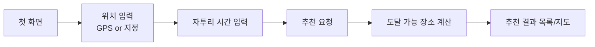

# 자투리 시간 여행 추천 웹 페이지 - 작업 리스트

## 프로젝트 개요

사용자로부터 **현재 위치(GPS) 또는 지정 위치**와 **자투리 시간**을 입력받아, 해당 시간 안에 왕복(또는 도착)할 수 있는 여행 장소를 추천하는 웹 서비스.

### 핵심 사용자 흐름



### 기술 스택 (제안)

| 영역 | 스택 |
| --- | --- |
| 프론트엔드 | React + TypeScript, Vite, 지도 SDK(Kakao/Naver/Google Maps) |
| 백엔드 | Node.js + Express (또는 FastAPI), REST API |
| 외부 API | 지도/장소 검색 API, 길찾기(이동시간) API |
| 데이터 | 여행지 데이터셋 / 장소 검색 API 연동 |
| 배포/인프라 | Vercel(FE), Render/EC2(BE), GitHub Actions |

---

## 역할 분담 요약

| 담당자 | 역할 | 핵심 책임 |
| --- | --- | --- |
| **개발자 A** | 프론트엔드 - 입력 & UI | 첫 화면, 위치/시간 입력, GPS 연동, 상태 관리 |
| **개발자 B** | 프론트엔드 - 결과 & 지도 | 추천 결과 목록, 지도 시각화, 상세 화면 |
| **개발자 C** | 백엔드 & 추천 로직 | API 서버, 이동시간 계산, 추천 알고리즘, 외부 API 연동 |

> 프론트 2명 / 백엔드 1명 구성. 공통 작업(프로젝트 셋업, API 인터페이스 정의)은 셋이 함께 초기에 합의합니다.

---

## 공통 선행 작업 (전원 협의)

- [x] 저장소 구조 결정 (monorepo vs FE/BE 분리) — **FE/BE 분리** 채택
- [x] 사용할 지도/길찾기 API 확정 (Kakao Map, Naver, Google 중 택1) — **Kakao Map**
- [x] **API 인터페이스 계약(Contract) 정의** — 요청/응답 JSON 스키마 합의 (아래 참고)
- [x] 브랜치 전략 / 커밋 컨벤션 / 코드 리뷰 규칙 합의
- [x] 환경변수(.env) 및 API 키 관리 방식 합의 (키는 저장소에 커밋 금지)
- [ ] 디자인 시안 / 와이어프레임 공유

### API 계약 초안 (협의용)

**추천 요청** `POST /api/recommendations`
```json
{
  "location": { "lat": 37.5665, "lng": 126.9780 },
  "availableMinutes": 90,
  "mode": "driving"
}
```

**추천 응답**
```json
{
  "places": [
    {
      "id": "p1",
      "name": "남산공원",
      "category": "공원",
      "lat": 37.5512,
      "lng": 126.9882,
      "travelMinutes": 20,
      "distanceKm": 5.2,
      "thumbnail": "https://...",
      "description": "..."
    }
  ]
}
```

---

## 개발자 A — 프론트엔드 (입력 & 첫 화면)

### 초기 세팅
- [x] React + TypeScript + Vite 프로젝트 생성
- [x] 라우팅 구성 (첫 화면 → 결과 화면)
- [x] 공통 UI 컴포넌트 / 스타일 시스템 세팅 (예: Tailwind, CSS Modules)

### 첫 화면 & 위치 입력
- [x] 첫 화면(랜딩) 레이아웃 구현
- [x] **현재 위치(GPS)** 가져오기 — `navigator.geolocation` 연동
- [x] GPS 권한 거부 / 실패 시 예외 처리 및 안내 UI
- [ ] **지정 위치 입력** — 주소/장소 검색 자동완성 (지도 API 연동) *(현재 라벨만 입력, 좌표 임시 고정)*
- [ ] 위치 선택 결과를 지도 마커/좌표로 확정

### 자투리 시간 입력
- [x] 자투리 시간 입력 UI (슬라이더 / 프리셋 버튼 30·60·90분 / 직접 입력)
- [x] 이동 수단 선택 옵션 (도보 / 대중교통 / 자동차)
- [x] 입력값 유효성 검증 (시간 범위, 위치 필수 등)

### 상태 관리 & 연동
- [x] 전역 상태 관리 세팅 (Context/Zustand 등)
- [x] 추천 요청 API 호출 및 로딩/에러 상태 처리
- [x] 결과 화면으로 데이터 전달

---

## 개발자 B — 프론트엔드 (결과 & 지도 시각화)

### 추천 결과 화면
- [ ] 추천 결과 목록 화면 레이아웃 *(최소 목록 구현, 스타일 보강 필요)*
- [ ] 장소 카드 컴포넌트 (이름, 카테고리, 이동시간, 거리, 썸네일) *(썸네일 미포함)*
- [ ] 정렬/필터 기능 (이동시간순, 거리순, 카테고리별)
- [ ] 결과 없음 / 로딩 / 에러 상태 UI *(결과 없음/로딩 처리됨)*

### 지도 시각화
- [ ] 지도 컴포넌트 통합 (Kakao/Naver/Google SDK)
- [ ] 사용자 위치 마커 + 추천 장소 마커 표시
- [ ] 마커 클릭 시 장소 정보 팝업(InfoWindow)
- [ ] 목록 ↔ 지도 상호 연동 (카드 hover/클릭 시 마커 강조)
- [ ] 경로/이동시간 시각화 (선택)

### 상세 & 마무리
- [ ] 장소 상세 화면/모달 (설명, 사진, 외부 지도 길찾기 링크)
- [ ] 반응형(모바일 우선) 레이아웃 대응
- [ ] 접근성(ARIA, 키보드 내비게이션) 점검

---

## 개발자 C — 백엔드 & 추천 로직

### 서버 세팅
- [ ] 백엔드 프로젝트 초기화 (Express/FastAPI)
- [ ] 프로젝트 구조 / 라우팅 / 에러 핸들링 미들웨어 구성
- [ ] CORS, 환경변수, 로깅 설정
- [ ] API 문서화 (Swagger/OpenAPI)

### 외부 API 연동
- [ ] 지도/장소 검색 API 연동 (주변 여행지 조회)
- [ ] 길찾기/이동시간 API 연동 (출발지 → 각 장소 소요시간)
- [ ] 외부 API 응답 캐싱 / 호출 최적화 (요금·속도 고려)

### 추천 로직
- [ ] `POST /api/recommendations` 엔드포인트 구현
- [ ] 입력 위치 기준 후보 장소 수집
- [ ] **자투리 시간 내 도달 가능 여부 필터링** (편도 or 왕복 기준 정의)
- [ ] 이동수단별 이동시간 계산 로직
- [ ] 추천 랭킹/스코어링 (이동시간, 거리, 인기도 등 가중치)
- [ ] 입력값 유효성 검증 및 에러 응답 규격화

### 데이터 & 배포
- [ ] 여행지 데이터 소스 확보/정제 (또는 검색 API 실시간 조회)
- [ ] 필요 시 DB 설계 (장소, 카테고리)
- [ ] 단위 테스트 (추천 로직 핵심 케이스)
- [ ] 배포 환경 구성 및 API 키 보안 관리

---

## 통합 & 마무리 (전원)

- [ ] FE ↔ BE 통합 테스트
- [ ] 주요 시나리오 E2E 확인 (GPS 추천 / 지정 위치 추천 / 시간대별)
- [ ] 예외 케이스 점검 (위치 실패, 결과 없음, API 오류)
- [ ] 성능 점검 (응답 속도, 지도 렌더링)
- [ ] 배포 및 데모 준비

---

## 마일스톤 (제안)

| 단계 | 목표 |
| --- | --- |
| **1. 셋업** | 저장소·API 계약·디자인 확정, 각자 프로젝트 초기화 |
| **2. 핵심 기능** | A: 입력 화면 / B: 결과·지도 / C: 추천 API (Mock 데이터로 병렬 개발) |
| **3. 연동** | 실제 API 연결, FE-BE 통합 |
| **4. 완성** | 예외 처리, 반응형, 테스트, 배포 |

> **병렬 개발 팁:** 초기에 API 계약을 확정하고 FE는 Mock 응답으로, BE는 실제 로직으로 각각 독립 개발하면 대기 없이 진행할 수 있습니다.
