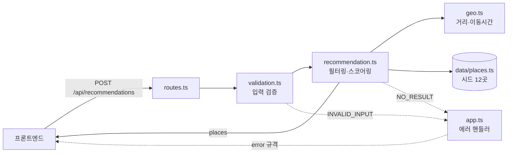

# 2026-07-09 19:15 백엔드 추천 API 초기 구현

## 작업 요약

개발자 C 영역인 백엔드를 Node.js + Express + TypeScript로 신규 구현했다. `POST /api/recommendations` 엔드포인트가 동작하며, 프론트엔드가 Mock 대신 실제 서버를 호출할 수 있는 상태가 되었다. 외부 지도/길찾기 API 키가 없어 서울 도심 시드 데이터와 거리 기반 이동시간 추정으로 추천 로직을 구현했고, 추후 Kakao API로 교체할 수 있도록 구조를 분리했다.

## 요청 흐름

## 변경 사항

- `backend/` 신규 생성 (Express + TypeScript, ESM/NodeNext)
  - `src/server.ts` / `src/app.ts` — 진입점, CORS·JSON 파서·404·중앙 에러 핸들러
  - `src/routes.ts` — `POST /api/recommendations`
  - `src/validation.ts` — 요청 검증 (좌표·시간 범위 10~180분·mode·tags·tripType)
  - `src/recommendation.ts` — 도달 가능 필터링(편도/왕복) + 잔여시간·태그 스코어링
  - `src/geo.ts` — Haversine 거리 + 이동수단별 속도·우회 보정 이동시간 추정
  - `src/data/places.ts` — 서울 도심 후보 장소 시드 12곳
  - `src/errors.ts` / `src/types.ts` — 에러 규격(AppError) 및 공용 타입
  - `README.md`, `.env.example`, `.gitignore`, `tsconfig.json`
- `docs/task-checklist.md` — 개발자 C 항목 상태 갱신
- `docs/dashboard/index.html` — 개발자 C 진행 상태 갱신

## 검증

- `npm --prefix backend run build` 성공 (타입 오류 없음)
- 서버 기동 후 확인:
  - `GET /health` → `{"status":"ok"}`
  - 정상 요청 → 추천 목록 반환
  - `availableMinutes` 누락 → `INVALID_INPUT`

## 관련 커밋 해시

- `082da32` [backend] 추천 API 서버 초기 구현 (Express + TypeScript)
- 문서 갱신 커밋: 본 devlog와 함께 커밋 예정

## 다음 단계 / 남은 작업

- FE ↔ BE 통합: 프론트 `.env`에 `VITE_API_BASE_URL=http://localhost:4000` 설정 후 연동 확인
- 추천 로직 단위 테스트 추가
- (선택) Kakao 장소검색·길찾기 API 연동으로 시드 데이터/이동시간 추정 대체
