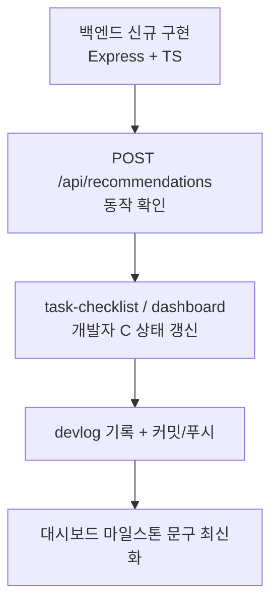

# 2026-07-09 19:40 세션 핸드오프 — 백엔드 구현 완료, FE-BE 통합 대기

> 다른 세션/작업자가 이 프로젝트를 바로 이어받기 위한 인수인계 문서입니다.
> 직전 핸드오프: [2026-07-09-18-33-session-handoff.md](2026-07-09-18-33-session-handoff.md)

## 현재 상태 한줄 요약

백엔드(개발자 C) 추천 API가 신규 구현·푸시되었고, 프론트에는 카카오 장소 검색 자동완성까지 들어왔다. **아직 프론트는 Mock 데이터를 사용 중**이라, 다음 세션의 최우선 작업은 **FE ↔ BE 실제 연동**이다.

## 이번 세션에 한 일



- `backend/` 신규 생성 (Node.js + Express + TypeScript, ESM/NodeNext)
- `POST /api/recommendations`, `GET /health` 구현 및 로컬 검증 완료
- 문서 갱신: `docs/task-checklist.md`, `docs/dashboard/index.html`
- devlog 추가: [2026-07-09-19-15-backend-recommendation-api.md](2026-07-09-19-15-backend-recommendation-api.md)

> 참고: 같은 시점에 개발자 A가 원격에 **카카오 장소 검색 자동완성**(`5b1fbdd`)과 **`dev-server.sh` 스크립트**를 푸시했다. rebase로 통합됨.

## 저장소 구조 (현재)

```
frontend/   React + TS + Vite (입력·결과·지도 구현, 카카오 검색 연동)
backend/    Node.js + Express + TS (추천 API — 이번 세션 신규)
dev-server.sh  개발 서버 관리 스크립트 (start/stop/restart/status/logs)
docs/
  product-requirements.md  제품 요구사항(SSOT)
  task-checklist.md        작업 체크리스트
  dashboard/index.html     진행 대시보드 (DATA 객체 수정으로 갱신)
  personas/user-personas.md 사용자 페르소나
  devlog/                  개발 로그
```

## 백엔드 요약

```bash
npm --prefix backend install
npm --prefix backend run dev     # tsx watch, http://localhost:4000
npm --prefix backend run build   # tsc → dist/
npm --prefix backend start       # node dist/server.js
```

- 엔드포인트: `POST /api/recommendations`, `GET /health`
- 추천 로직: 서울 도심 시드 12곳(`src/data/places.ts`) + Haversine 거리·이동수단별 속도 추정(`src/geo.ts`) → 도달 가능 필터링(편도/왕복) + 잔여시간·태그 스코어링(`src/recommendation.ts`)
- 에러 규격: `AppError`로 `INVALID_INPUT` / `NO_RESULT` / `UPSTREAM_ERROR` (`src/errors.ts`)
- 환경변수: `PORT`(기본 4000), `CORS_ORIGIN`(미설정 시 전체 허용) — `backend/.env.example` 참고
- **외부 API·DB 미연동**: 현재 시드 데이터/추정치. Kakao 장소검색·길찾기 API로 교체 가능하도록 분리해 둠.

## FE ↔ BE 연동 방법 (다음 세션 최우선)

현재 `frontend/.env` 의 `VITE_API_BASE_URL` 이 **비어 있어 프론트가 Mock 응답을 사용**한다. 실제 연동하려면:

```bash
# frontend/.env
VITE_API_BASE_URL=http://localhost:4000
```

설정 후 백엔드(4000)와 프론트(5173)를 함께 띄우고 입력→추천→결과 흐름을 확인한다.
백엔드 CORS 기본 허용 오리진은 `http://localhost:5173` (`backend/.env.example`).

## 알려진 임시/미완 사항

- **FE-BE 통합 미완료** — `VITE_API_BASE_URL` 비어 있음(위 참고). 최우선.
- `HomePage.tsx` 의 `handleManualConfirm` 서울시청(37.5665, 126.978) 하드코딩은 이제 **카카오 SDK 키가 없을 때의 폴백**으로만 사용됨(정상 경로는 검색 자동완성).
- 백엔드 **단위 테스트 없음**.
- 외부 API(장소검색/길찾기) 실연동, 응답 캐싱, API 문서화(Swagger), DB 설계, 배포 환경 미완.
- 경로/이동시간 시각화(선택) 미구현.

## 다음 작업 후보 (우선순위 제안)

1. **FE ↔ BE 통합** — `VITE_API_BASE_URL` 설정 후 E2E 흐름 확인, 응답 스키마 정합성 검증.
2. 백엔드 **추천 로직 단위 테스트** 추가(도달 가능 필터·스코어링 핵심 케이스).
3. 통합 후 예외 케이스 점검(위치 실패, 결과 없음(`NO_RESULT`), API 오류).
4. (선택) Kakao 장소검색·길찾기 API로 시드 데이터/이동시간 추정 대체.

## 관련 커밋 해시

- `082da32` [backend] 추천 API 서버 초기 구현 (Express + TypeScript)
- `75e7fbc` [docs] 백엔드 구현 반영 및 devlog 추가
- `1fe7bff` [docs] 대시보드 마일스톤 문구 최신화
- (개발자 A, 원격) `5b1fbdd` 카카오 장소 검색 자동완성, `952f2fc` 카카오 SDK 로더 경쟁 조건 수정
