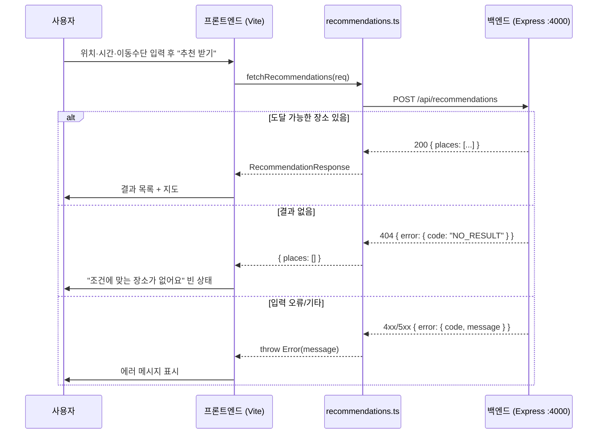

# 2026-07-09 19:56 FE ↔ BE 통합 — 프론트가 실제 추천 API 사용

> 직전 핸드오프: [2026-07-09-19-40-session-handoff.md](2026-07-09-19-40-session-handoff.md)

## 작업 요약

핸드오프 문서의 최우선 과제였던 **프론트엔드 ↔ 백엔드 실제 연동**을 완료했다. 그동안 프론트는 `VITE_API_BASE_URL` 이 비어 있어 Mock 데이터를 사용했으나, 이제 로컬 백엔드(`http://localhost:4000`)의 추천 API를 실제로 호출한다. 브라우저에서 입력 → 추천 → 결과 흐름을 E2E로 검증했다.

## 통합 흐름

## 변경 사항

- `frontend/.env`: `VITE_API_BASE_URL=http://localhost:4000` 설정 (gitignore 대상, 커밋 안 됨)
- `frontend/src/api/recommendations.ts`: 실제 백엔드 호출 시 에러 규격(`{error:{code,message}}`) 파싱 추가
  - `NO_RESULT`(HTTP 404) → Mock 모드와 동일하게 `{ places: [] }` 로 변환해 결과 화면의 빈 상태 UI를 재사용
  - 그 외 에러 → 서버가 준 `message` 를 그대로 throw (기존엔 상태코드만 노출)

## 검증

- 백엔드 `npm --prefix backend run build` 통과
- 프론트 `npm --prefix frontend run build` (tsc + vite) 통과
- API 응답 규격 curl 확인: 정상(200), `NO_RESULT`(404), `INVALID_INPUT`(400)
- 브라우저 E2E: 서울시청·60분·대중교통 → 실제 백엔드 시드 12곳 중 도달 가능한 11곳이 이동시간순으로 표시됨 (Mock 3곳 아님 → 실제 연동 확인)

## 알려진 미완/이슈

- **Kakao 지도 SDK 브라우저 로드 차단**: `dapi.kakao.com/.../sdk.js` 요청이 `net::ERR_BLOCKED_BY_ORB` 로 실패. 결과 페이지 지도가 "지도 불러오는 중…" 에서 멈춤. 이번 FE-BE 연동과는 별개 이슈로, Kakao 개발자 콘솔의 플랫폼 도메인 등록(`localhost` 포트) 확인 필요.
- 백엔드 단위 테스트 없음 (다음 우선순위 후보).
- 외부 API(장소검색/길찾기) 실연동, 캐싱, API 문서화, DB, 배포 미완.

## 다음 작업 후보

1. Kakao 지도 SDK ORB 차단 해결 (도메인/포트 등록 점검).
2. 백엔드 추천 로직 단위 테스트 추가.
3. 예외 케이스 UX 다듬기 (NO_RESULT 빈 상태, 네트워크 오류 메시지).
