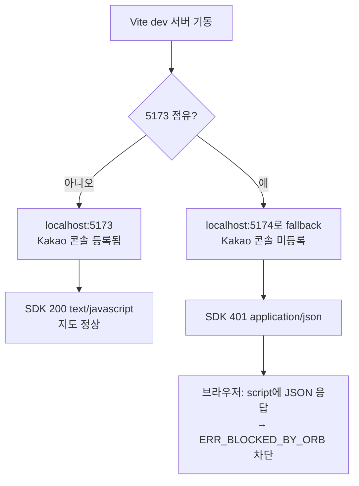

# 2026-07-09 20:29 Kakao 지도 ORB 차단 해결 + Playwright E2E 도입

> 직전 devlog: [2026-07-09-19-56-kijeong-fe-be-integration.md](2026-07-09-19-56-kijeong-fe-be-integration.md)

## 작업 요약

결과 페이지 지도가 `net::ERR_BLOCKED_BY_ORB`로 "지도 불러오는 중…"에서 멈추던 문제를 해결했다. 원인은 서버 미등록이 아니라 **Vite 개발 서버 포트 불일치**였다. 이어서 Python(Playwright) 기반 E2E 테스트를 도입해 전체 흐름을 자동 검증하고, `dev-server.sh`가 백엔드까지 함께 관리하도록 확장했다.

## 근본 원인

- Kakao 개발자 콘솔에는 `http://localhost:5173`만 등록되어 있음
- 5173이 점유되면 Vite가 자동으로 5174로 넘어가는데, 이 origin은 미등록이라 SDK가 401(JSON)을 반환
- 브라우저는 `<script>`가 기대한 `text/javascript` 대신 JSON을 받으면 ORB로 차단

## 변경 사항

- `frontend/vite.config.ts`: `server.port=5173` + `strictPort:true`로 포트 고정 (원격에서 동일 수정이 먼저 반영되어 커밋 `ffcf706`으로 통합됨)
- `scripts/dev-server.sh`: 프론트 전용 → **프론트+백엔드 통합 관리**로 확장
  - `start|stop|restart|status [front|back|all]`, 기본값 `all`(백엔드 먼저 기동)
  - 서비스별 PID/로그 분리: `.run/dev-front.*`, `.run/dev-back.*`
- `tests/e2e/test_recommendation_flow.py`: Playwright E2E 신규
  - 검색 자동완성 → 위치 선택 → 추천 → 결과·지도 타일 렌더까지 검증
  - Kakao SDK 401(ORB) 응답을 감시하는 fixture로 재발 방지
- `.gitignore`: Python `.venv/`, `__pycache__/`, `.pytest_cache/`, 아티팩트 무시

## 검증

- `curl`로 포트별 SDK 응답 비교: 5173→200/`text/javascript`, 5174→401/`json` (원인 확정)
- Playwright E2E: **PASSED** — 추천 카드 11개, 지도 타일 46개 렌더 확인 (스크린샷 저장)
- `dev-server.sh start`로 백엔드(:4000)+프론트(:5173) 동시 기동, 백엔드 `/health` 200 확인
- 테스트 환경: pyenv 3.14.3 기반 `.venv`, pytest + playwright(chromium)

## 관련 커밋 해시

- `ffcf706` [frontend] vite dev 서버 포트 5173 고정 (원격 통합)
- `aafa8ad` [scripts] dev-server.sh가 백엔드도 함께 관리하도록 확장
- `98e02bb` [test] Playwright 기반 E2E 추천 흐름 테스트 추가

## 다음 작업 후보

1. 백엔드 추천 로직 단위 테스트 추가 (도달 가능 필터·스코어링).
2. 예외 케이스 E2E 확장 (GPS 추천, `NO_RESULT` 빈 상태, 네트워크 오류).
3. (선택) Kakao 장소검색·길찾기 API로 시드 데이터/이동시간 추정 대체.
