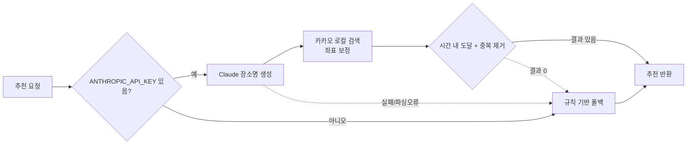

# 2026-07-09 20:39 Claude LLM 기반 장소 추천 연동

## 작업 요약

- 고정 후보 목록에만 의존하던 추천을 **Claude(LLM) 기반 추천**으로 확장했습니다.
- Claude가 입력 조건(위치·틈나는 시간·이동 수단·태그)에 맞는 실제 장소명을 생성하고, 좌표는 카카오 로컬 검색으로 보정합니다.
- 사내 LLM 게이트웨이가 **OpenAI 호환 형식**임을 확인하고 그에 맞게 호출하도록 구현했습니다.
- Claude 키가 없거나 호출/파싱에 실패하면 기존 규칙 기반 추천으로 자동 폴백합니다.

## 처리 흐름

## 변경 사항

- `backend/src/llm.ts` (신규): Claude 호출. OpenAI 호환 `POST {BASE_URL}/chat/completions` + `Authorization: Bearer`. system 메시지로 JSON 강제, 스마트따옴표/trailing comma 보정 파싱
- `backend/src/kakao.ts` (신규): 카카오 로컬 키워드 검색으로 장소명→좌표 보정. 정확도 정렬 + 부속시설(출구/주차장/화장실 등) 노이즈 필터링
- `backend/src/recommendation.ts`: `recommendPlaces`를 async로 전환. LLM 파이프라인 + 좌표 보정 + 중복 제거, 실패 시 `recommendByRules`로 폴백
- `backend/src/routes.ts`: async 핸들러 + try/catch로 에러를 중앙 핸들러에 전달
- `backend/package.json`: `--env-file=.env`로 `.env` 로드. (Anthropic SDK는 게이트웨이 비호환이라 미사용)
- `backend/.env.example`: `ANTHROPIC_API_KEY`, `ANTHROPIC_BASE_URL`, `ANTHROPIC_MODEL`, `KAKAO_REST_API_KEY` 문서화

## 검증

- 백엔드/프론트 `npm run build` 모두 통과
- 브라우저 E2E: 홍대입구역/60분/대중교통 → 덕수궁·서울광장·청계천·명동거리·N서울타워 추천, 지도 마커·설명 정상 표시
- 조건 변경 시 추천 결과가 실제로 달라짐(을지로 카페 vs 강남 공원 등) 확인
- Claude 키/게이트웨이 미설정 또는 실패 시 규칙 기반 폴백 동작 확인

## 다음 단계 / 남은 작업

- 카카오 좌표 보정 품질 추가 개선(동명 이인 장소 구분, 카테고리 정합성)
- 이동시간 추정을 카카오 길찾기 API 실측으로 대체 검토
- 노출된 API 키(카카오 JS/REST, LLM 게이트웨이) 운영 전 재발급
