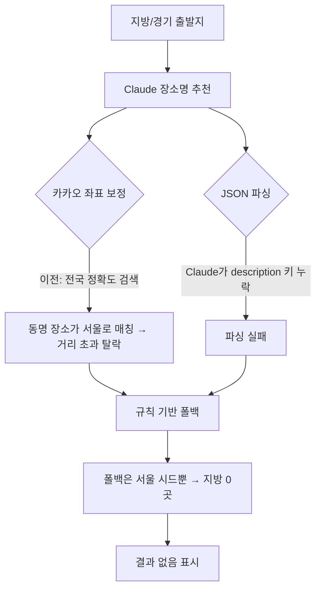

# 2026-07-09 22:08 경기/지방 추천 누락 버그 수정

## 작업 요약

- 서울(수도권)에서는 추천이 잘 나오지만 판교·부산 등 경기/지방에서 결과가 안 나오던 문제를 해결했습니다.
- 원인이 두 가지 겹쳐 있어 순차적으로 진단·수정했습니다: (1) 좌표 보정이 출발지를 무시한 전국 검색, (2) LLM JSON 파싱 실패 시 서울 전용 폴백.

## 원인 분석

## 변경 사항

- `backend/src/kakao.ts`:
  - `searchPlace`가 출발지 중심 **반경 20km 우선 검색**(x/y/radius) 후, 없으면 전국 검색으로 폴백하도록 변경 (동명 장소 오매칭 방지)
  - `reverseGeocode` 추가: 좌표→행정구역명 변환으로 LLM에 지역 명시
- `backend/src/recommendation.ts`: 역지오코딩한 지역명을 LLM 프롬프트(`originLabel`)에 전달
- `backend/src/llm.ts`: JSON 파싱 완전 실패 시 **정규식으로 name/category만 복구**하는 salvage 로직 추가 (Claude가 description 키를 누락해도 장소명 확보)

## 검증

- 백엔드 `npm run build` 통과
- 판교역(60분/대중교통): 매 요청 3~5곳 일관되게 반환 (이전엔 간헐적 0곳)
- 부산 서면(120분): 부산시민공원·용두산공원·보수동책방골목 등 7곳 정상
- API 다회 호출로 일관성 확인 (파싱 실패해도 salvage로 결과 확보)

## 관련 커밋 해시

- `689cfae` [backend] 경기/지방 추천 누락 수정 - 출발지 기준 지역 검색 적용
- `7e57e98` [backend] LLM 응답 JSON 파싱 견고화로 지역별 추천 누락 해결

## 다음 단계 / 남은 작업

- 규칙 기반 폴백이 서울 시드 데이터에 편중되어 있음 → LLM 완전 실패 시에도 출발지 주변 카카오 카테고리 검색으로 폴백하도록 개선 검토
- 결과 화면 지도 로딩이 간헐적으로 "지도 불러오는 중"에 머무는 현상 추가 확인 필요
- 이동시간 추정을 카카오 길찾기 API 실측으로 대체 검토
