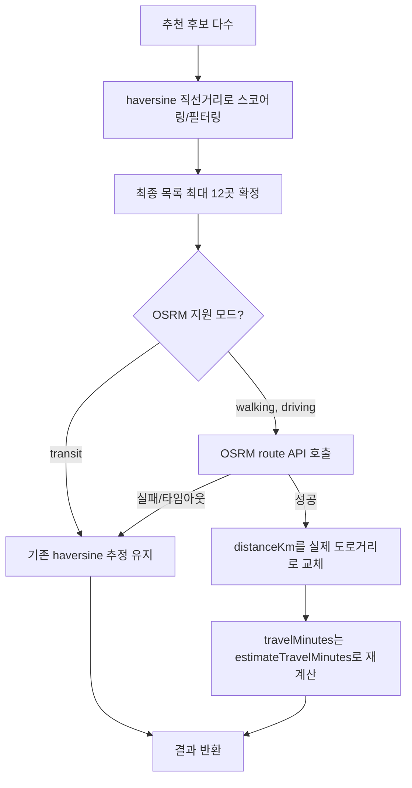

# 2026-07-09 22:37 OSRM 기반 실제 도로 거리 보정 추가

## 작업 요약

- 사용자 피드백: 추천 결과 상세 정보의 거리(`distanceKm`)가 카카오맵에서 보는 실제 거리와 다르다는 지적을 받고 원인을 조사했습니다.
- 원인: `haversineKm()`이 두 좌표 간 **직선거리**만 계산하는데, 이 값이 그대로 화면에 노출되고 있었습니다. 실제 도로는 직선이 아니므로 항상 직선거리 ≤ 실제 이동거리이며 지역에 따라 차이가 컸습니다.
- 별도 API 키 발급 없이 즉시 적용 가능한 오픈소스 라우팅 엔진 **OSRM**(공개 데모 서버)을 도입해 최종 추천 목록의 거리만 실제 도로 기반으로 보정했습니다.

## 원인 분석 및 설계

- 스코어링/필터링 단계는 haversine 추정치를 그대로 사용해 속도를 유지하고, **사용자에게 노출되는 최종 결과에만** OSRM 보정을 적용해 API 호출량을 최소화했습니다.
- OSRM의 `duration`(이동시간)은 신뢰하지 않았습니다. 실측 결과 공개 데모 서버(`router.project-osrm.org`)의 `foot` 프로필이 표준 osrm-backend 프로필과 달라(GitHub 공식 위키에 명시된 known limitation) 도보 400m를 29.6초(≈시속 50km)로 응답하는 등 비정상적인 값을 반환했습니다. 따라서 **거리만 OSRM에서 가져오고, 이동시간은 기존에 검증된 `estimateTravelMinutes()`(우회계수 포함)로 재계산**하도록 설계했습니다.
- `transit`(대중교통)은 OSRM이 지원하지 않아 기존 haversine 추정을 그대로 사용합니다.
- OSRM 호출 실패(네트워크/타임아웃) 시 자동으로 기존 추정치로 폴백해 서비스 중단 위험이 없습니다.

## 변경 사항

- `backend/src/osrm.ts` (신규): OSRM route API 호출 함수. `walking`→`foot`, `driving`→`car` 프로필 매핑, 4초 타임아웃, 실패 시 `null` 반환.
- `backend/src/recommendation.ts`: `refineWithOsrm()` 추가. LLM 기반/규칙 기반 추천 양쪽 경로 모두, 최종 반환 직전에 거리를 보정하고 보정된 거리로 왕복/편도 시간을 재검증해 자투리 시간을 초과하면 제외.
- `backend/.env.example`: `OSRM_BASE_URL`(선택) 문서화. 미설정 시 공개 데모 서버 사용.

## 검증

- `npm run typecheck` 통과.
- 백엔드 재기동 후 `walking`/`driving`/`transit` 3개 모드로 실제 `/api/recommendations` 호출:
  - `walking`: 거리가 직선거리보다 커지고(예: 덕수궁 1.1km), `travelMinutes`가 정상 도보 속도 기준으로 계산됨(18분 등).
  - `driving`: OSRM 도로거리 반영, 시간 정상.
  - `transit`: OSRM 미지원이라 기존 haversine 추정 그대로 유지됨을 확인.
- 원격(`origin/main`)에 동시에 반영된 지역 인지 개선(`reverseGeocode`/`originLabel`) 커밋과 병합 시 `recommendation.ts` import 문에서만 충돌 발생, 양쪽 유지로 해결 후 재검증 완료.

## 관련 커밋 해시

- `eca3534` [backend] OSRM 기반 실제 도로 거리 보정 추가
- `1097926` [backend] origin/main과 병합 - OSRM 거리 보정 + 지역 인지 개선 통합

## 다음 단계 / 남은 작업

- OSRM 공개 데모 서버는 SLA가 없고 상업적 대량 사용에는 부적합 (1 req/sec 권장). 트래픽이 늘면 자체 호스팅 OSRM 서버로 `OSRM_BASE_URL`을 교체 검토.
- `transit`(대중교통) 실제 경로/시간 보정은 아직 미해결 — OSRM이 지원하지 않으므로 별도 대중교통 API(카카오 길찾기 등) 연동 필요.
- OSRM 응답 캐싱(동일 출발지-목적지 좌표 재조회 방지)으로 API 호출량 추가 절감 검토.
