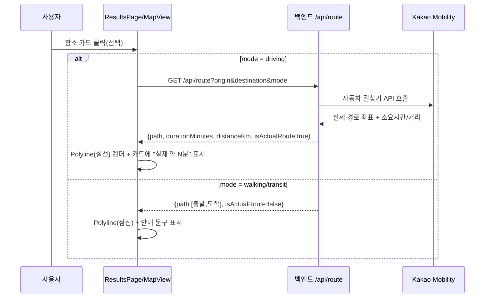

# 2026-07-09 23:01 경로/이동시간 시각화 구현 (개발자 B 선택 항목)

## 작업 요약

- 대시보드에 미구현으로 남아 있던 "경로/이동시간 시각화(선택)" 항목을 구현했습니다.
- 자동차 이동은 Kakao Mobility 길찾기로 실제 도로 경로와 소요시간을 지도에 표시하고, 도보/대중교통은 Kakao가 해당 경로를 제공하지 않아 직선으로 대체합니다.

## 처리 흐름

## 변경 사항

- `backend/src/route.ts` (신규): Kakao Mobility Directions API로 자동차 실제 경로 조회. 도보/대중교통은 직선 대체 반환
- `backend/src/routes.ts`: `GET /api/route?origin=lat,lng&destination=lat,lng&mode=...` 엔드포인트 추가
- `backend/src/validation.ts`: 경로 조회 쿼리 파라미터 검증(`parseRouteQuery`) 추가, `parseLocation` export
- `frontend/src/api/route.ts` (신규): 백엔드 호출. `VITE_API_BASE_URL` 미설정(Mock 모드) 시 직선 대체
- `frontend/src/components/MapView.tsx`: 장소 선택 시 경로 조회 → Polyline 렌더(실제 경로는 실선, 대체는 점선), 상위로 실제 시간 콜백(`onRouteChange`)
- `frontend/src/components/PlaceCard.tsx`: 선택된 카드에 한해 "실제 약 N분"으로 갱신 표시
- `frontend/src/pages/ResultsPage.tsx`: 대체 경로일 때 안내 문구(`results__route-note`) 표시
- `frontend/src/types/kakao-maps.d.ts`: `Polyline` 타입 선언 추가
- `docs/task-checklist.md`, `docs/dashboard/index.html`: 해당 항목 완료 반영

## 검증

- 백엔드/프론트 `npm run build` 통과
- `/api/route` 직접 호출: driving은 `isActualRoute=true`(실제 도로 좌표 100+ 개), walking/transit은 `isActualRoute=false`(직선 2점)
- 브라우저 E2E: 서울역(자동차)에서 남산공원 선택 → 카드가 "약 2분"에서 "실제 약 12분"으로 갱신
- 판교(경기권)에서도 동일하게 "탄천"이 "실제 약 10분"으로 정상 갱신 (지역 버그 수정과 함께 정상 동작 확인)

## 관련 커밋 해시

- `3fd693a` [backend] GET /api/route 경로 조회 엔드포인트 추가
- `b4ae35c` [frontend] 지도에 경로/실제 이동시간 시각화 추가

## 참고 / 다음 단계

- 같은 시점 원격에 병합된 OSRM 기반 거리 보정(`backend/src/osrm.ts`, YunYs)과는 목적이 다름: OSRM은 추천 목록 자체의 거리/시간 보정(좌표 없음), 이번 작업은 지도에 그릴 경로 좌표+선택 시 실시간 갱신. 상호 보완적이며 충돌 없음을 빌드로 확인함
- 도보 경로도 실제 인도 기반으로 그리려면 Kakao 도보 길찾기가 없어 별도 서비스(OSRM foot 프로필 등) 연동이 필요
- 대중교통 실제 노선 시각화는 Kakao/OSRM 모두 미제공이라 별도 대중교통 API 검토가 필요함
