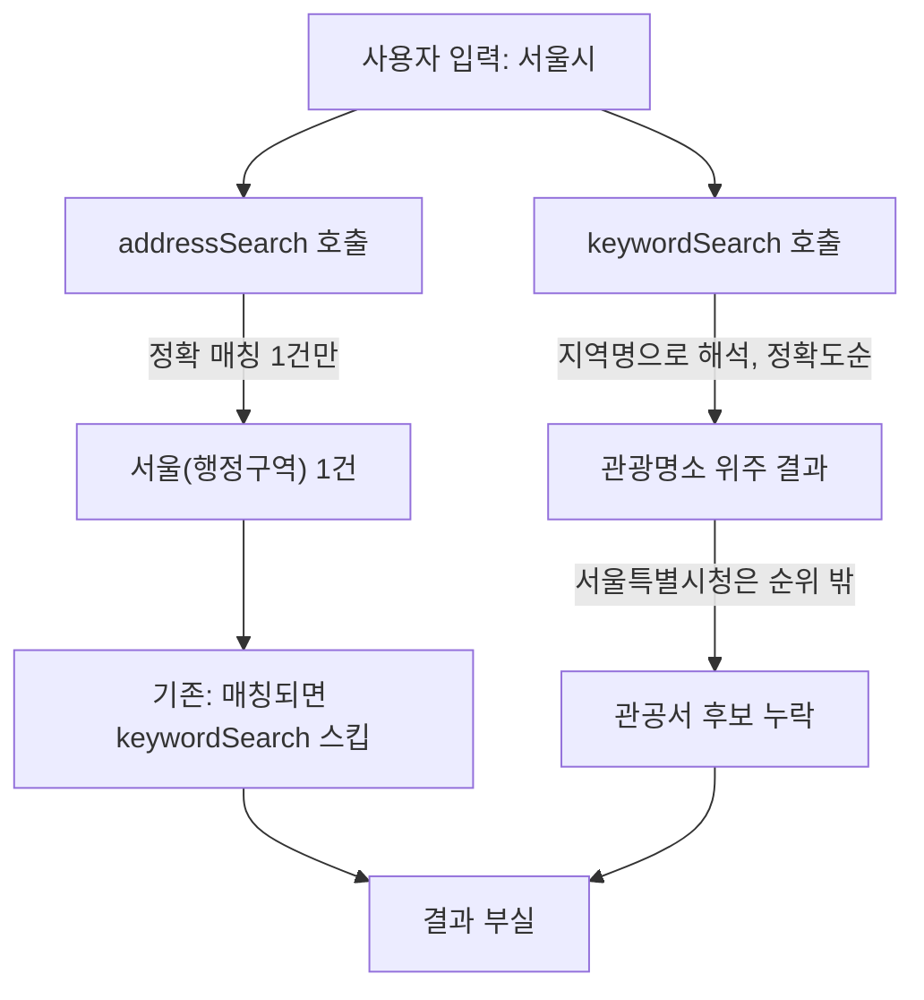

# 2026-07-09 23:10 위치 검색 자동완성 결과 개선

## 작업 요약

- "서울" 같은 짧은 지역명을 입력했을 때 관련 없는 장소(청계천, 경복궁 등)가 뒤섞여 나오는 문제와, "서울시"를 입력해도 "서울특별시청"이 후보에 없는 문제를 함께 해결했습니다.
- Kakao Maps 공개 API에는 카카오맵 웹사이트가 쓰는 자동완성 전용 엔드포인트가 없어(그건 비공개 내부 API), `keywordSearch`(정확도순 전문검색)와 `addressSearch`(정확 매칭)를 조합해 최대한 유사하게 재현했습니다.

## 원인 분석

- `addressSearch('서울시')`는 정확히 일치하는 주소 1건만 반환하는데, 기존 코드는 이 경우 `keywordSearch`를 호출하지 않고 종료해 다른 관련 결과가 전부 가려졌습니다.
- `keywordSearch('서울시')`는 Kakao가 이를 지역명으로 인식해(`meta.same_name.selected_region: "서울특별시"`) 관광명소 위주 결과를 정확도순으로 주는데, 실제 등록된 관공서 이름은 "서울시청"이 아니라 "**서울특별시청**"이라 이 쿼리로는 후보에 전혀 나오지 않았습니다. REST API로 직접 확인한 결과 `"서울시청"`으로 검색해야만 "서울특별시청"이 1위로 나왔습니다.

## 변경 사항

- `frontend/src/hooks/usePlaceSearch.ts`:
  - `addressSearch`와 `keywordSearch`를 항상 함께 호출해 결과를 병합(좌표 중복 제거 포함).
  - 입력어로 "시작하는" 이름을 우선 정렬해 접두어 일치 항목이 위로 오도록 개선.
  - `"OO시/도/구/군"` 패턴을 감지하면 `"OO시/도/구/군청"` 별칭으로 공공기관 카테고리(`PO3`) 한정 추가 검색을 수행해, 그 결과를 최우선으로 병합.
- `frontend/src/types/kakao-maps.d.ts`: `Geocoder`/`AddressSearchResultItem` 타입 추가, `KeywordSearchOptions.category_group_code` 필드 추가.

## 검증

- `npx tsc --noEmit` 통과.
- 브라우저에서 "서울" 입력 → "서울"(주소), "서울둘레길", "서울식물원"이 상단에, 이후 청계천/경복궁 등이 이어짐(이전엔 청계천이 최상단).
- "서울시" 입력 → "서울특별시청", "서울특별시청 무교로청사"가 최상단에 노출(이전엔 전혀 없었음).
- Kakao REST API를 직접 호출해 `category_group_code=PO3` 필터로 "서울시청" 검색 시 "서울특별시청"이 1위로 나옴을 확인 후 적용.

## 관련 커밋 해시

- `050a7fa` [frontend] 위치 검색 자동완성 결과 개선

## 다음 단계 / 남은 작업

- 카카오맵 자체 자동완성과 완전히 동일한 순위/커버리지는 비공개 API라 재현 불가능함을 인지하고 있음. 현재는 접두어 우선 정렬 + 관공서 별칭 보정으로 근사치를 제공하는 수준.
- "OO동", "OO읍" 등 다른 행정단위 패턴에 대한 관공서 별칭 보정(동사무소, 읍/면사무소 등)은 아직 다루지 않음 — 필요 시 패턴 확장 검토.
