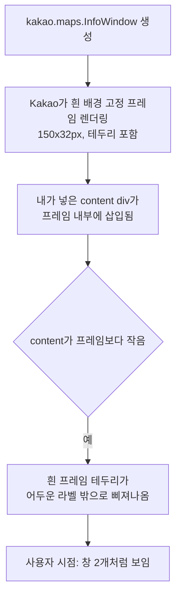

# 2026-07-09 23:31 지도 이름표 이중 창 버그 수정 (InfoWindow → CustomOverlay)

## 작업 요약

- 지도에서 장소 선택 시 뜨는 이름표가 "흰색 창 위에 검정 글자창이 겹쳐진 것처럼" 보이는 문제를 해결했습니다.
- 이전에 다크모드 대비를 위해 InfoWindow content에 배경/글자색을 지정했지만, Kakao InfoWindow 자체의 흰색 기본 프레임은 없어지지 않아 발생한 문제였습니다.

## 원인 분석



DOM 조사 결과, InfoWindow의 실제 렌더 구조는 다음과 같았습니다.
```
<div style="background:#fff; border:1px solid ...; width:150px; height:32px; z-index:10;">  ← Kakao 기본 프레임 (제거 불가)
  <div style="background:#1f2937; color:#fff; ...">텍스트</div>                              ← 내가 넣은 content
</div>
```

## 변경 사항

- `frontend/src/types/kakao-maps.d.ts`: `CustomOverlay` 타입 선언 추가 (`position`, `content`, `xAnchor`, `yAnchor`, `zIndex`)
- `frontend/src/components/MapView.tsx`:
  - `kakao.maps.InfoWindow` → `kakao.maps.CustomOverlay`로 교체. CustomOverlay는 기본 프레임이 없어 순수하게 넘긴 엘리먼트만 렌더링됨
  - 라벨 엘리먼트를 `document.createElement`로 만들고 `textContent`로 이름을 넣어 XSS 이슈 자체가 발생하지 않도록 함 (기존 `escapeHtml` 헬퍼 제거)
  - 인라인 스타일로 어두운 배경(`#1f2937`) + 흰 글자 + box-shadow 유지

## 검증

- `npm run build` 통과
- 브라우저 DOM 검사: 지도 캔버스 내 `background-color: rgb(255,255,255)` 요소 개수 0건 확인 (이전엔 흰 프레임 1건 존재)
- `map-view__label` 클래스 엘리먼트만 존재, 배경/글자색이 의도대로 적용됨을 `getComputedStyle`로 확인
- 서울역 → 자동차 → 전쟁기념관 선택 시나리오로 재현 및 수정 확인

## 관련 커밋 해시

- `660f153` [frontend] 장소 이름표를 InfoWindow에서 CustomOverlay로 교체

## 병합 참고

- 같은 시점 원격에 병합된 위치 검색 자동완성 개선(YunYs, `category_group_code` 추가)과 `kakao-maps.d.ts`에서 겹쳤으나 자동 병합 성공, 빌드로 정합성 확인함.
