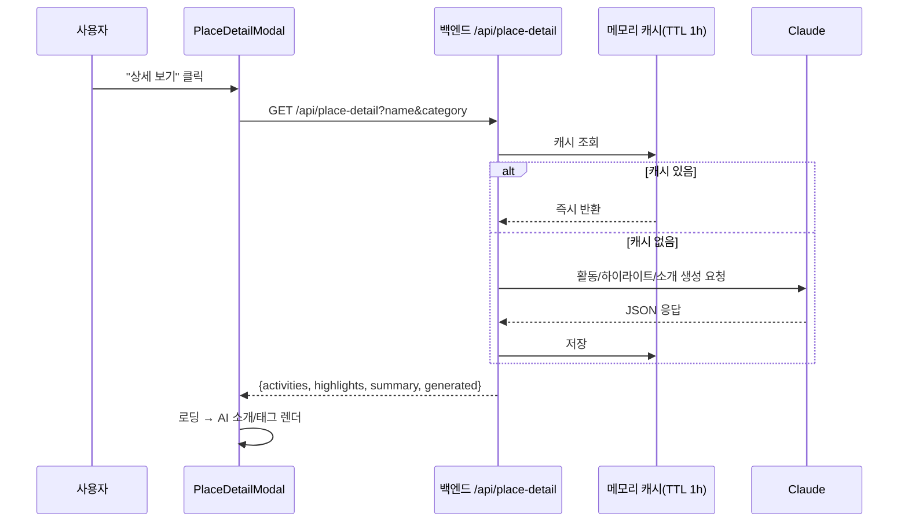

# 2026-07-09 23:59 상세 모달 LLM 정보 추가 + 장소 사진 기능 검토

## 작업 요약

- 장소 상세 모달에 "할 수 있는 활동", "이런 게 유명해요", AI 소개 문장을 LLM(Claude)으로 생성해 추가했습니다.
- 장소 사진 삽입 요청은 구현하지 않고 방식별 가능성만 검토했습니다(결론: 크롤링 비권장, Google Places Photos API가 현실적 대안).

## 처리 흐름 (상세 정보)

## 변경 사항

- `backend/src/llm.ts`: `generatePlaceDetail(name, category)` 추가. 장소명·카테고리만으로 활동 2~5개, 하이라이트 1~4개, 소개 2~3문장을 JSON으로 생성. "사실 기반, 지어내지 말 것" 지침 포함
- `backend/src/types.ts`: `PlaceDetailResponse` 타입 추가 (`generated` 플래그로 LLM 생성 여부 구분)
- `backend/src/validation.ts`: `parsePlaceDetailQuery` — name(필수, 100자 제한)/category 쿼리 검증
- `backend/src/routes.ts`: `GET /api/place-detail` 추가. 메모리 Map 기반 캐시(TTL 1시간)로 같은 장소 반복 조회 시 LLM 재호출 방지. 키 없거나 생성 실패 시 최소 정보로 폴백
- `frontend/src/api/placeDetail.ts` (신규): 백엔드 호출, Mock 모드/실패 시 빈 폴백
- `frontend/src/components/PlaceDetailModal.tsx`: 모달 열릴 때 상세 정보 로드(로딩 상태 표시), AI 소개 문단 + 활동/하이라이트 태그 목록 렌더
- `frontend/src/pages/ResultsPage.css`: 상세 정보 섹션·태그 스타일 추가

## 사진 삽입 가능성 검토 결과 (구현 안 함)

| 방법 | 판단 |
| --- | --- |
| LLM 이미지 생성 | 부적합 — 실제 장소가 아닌 상상 이미지가 나와 사용자 오해 유발 |
| 웹 크롤링/스크래핑 | 비권장 — 저작권·이용약관 위반 소지, 안정성 낮음. 진행하지 않음 |
| Kakao Local API | 사진 URL 필드 없음(문서 확인) |
| Google Places Photos API | 가능 — 정식 라이선스, 별도 API 키·과금 정책 확인 필요. 다음 단계로 검토 가능 |
| "카카오맵에서 사진 보기" 링크 | 즉시 가능 — 기존 길찾기 링크처럼 외부 링크로 유도만 하는 방식 |

## 검증

- 백엔드/프론트 `npm run build` 통과
- `GET /api/place-detail?name=경복궁&category=고궁` 실제 호출 → 사실 기반 활동/하이라이트/소개 정상 생성 확인
- 캐시 동작 확인: 동일 요청 재호출 시 2ms 내 응답(LLM 미재호출)
- 브라우저 E2E: 서울역 → 국립중앙박물관 상세 보기 → AI 소개·활동 4개·하이라이트 3개 정상 렌더, 기존 길찾기 링크 유지 확인

## 관련 커밋 해시

- `5984262` [backend] LLM 기반 장소 상세 정보(활동/하이라이트/소개) API 추가
- `38fc27f` [frontend] 상세 모달에 LLM 기반 활동/하이라이트 정보 표시

## 다음 단계 / 남은 작업

- 사진 기능을 진행한다면 Google Places API 키 발급·과금 정책 확인 후 별도 작업으로 분리
- LLM 상세 정보 캐시를 서버 재시작 시에도 유지하려면 파일/DB 기반으로 전환 검토
