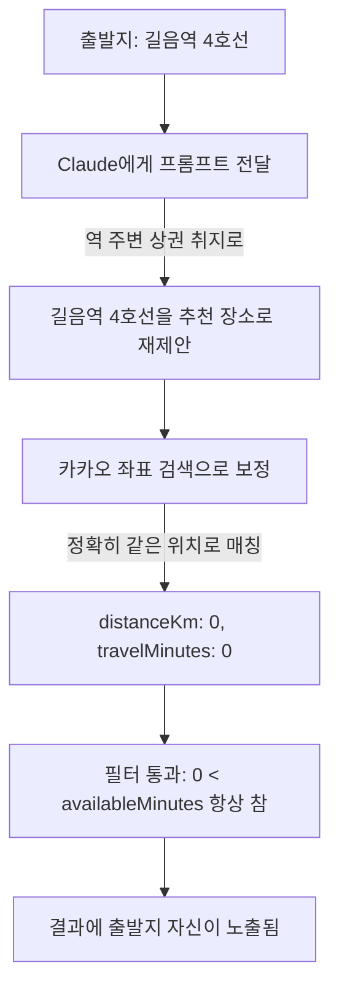

# 2026-07-10 07:48 출발지 자기 자신 추천 버그 수정

## 작업 요약

- "길음역 4호선"을 출발지로 검색해 도보 30분 조건으로 추천을 요청하면, 결과에 출발지 자신("길음역 4호선", 거리 0km, 이동시간 0분)이 그대로 나오는 버그를 발견하고 수정했습니다.

## 원인 분석

- `backend/src/llm.ts`의 추천 프롬프트에 "출발지 자체는 추천하지 마라"는 규칙이 없었습니다.
- `backend/src/recommendation.ts`의 `resolveLlmPlaces`는 "너무 멀어서 시간 초과"만 걸러내고, "거리가 0에 가까워 사실상 출발지 자신"인 경우를 걸러내는 로직이 없었습니다.

## 변경 사항

- `backend/src/llm.ts`: 프롬프트 요구사항에 "출발지 자체나 출발지와 정확히 같은 장소는 추천하지 마세요" 규칙 추가.
- `backend/src/recommendation.ts`: `resolveLlmPlaces`에서 출발지와의 거리가 `0.1km` 미만인 결과를 무조건 제외하는 안전장치 추가(LLM이 지시를 어겨도 걸러짐).

## 부가 조사: 30분/60분·도보 조건의 간헐적 NO_RESULT

- 수정 후 동일 좌표로 반복 테스트한 결과, 30분·도보 조건에서 5번 중 4번이 `NO_RESULT`로 나왔습니다.
- 원인: 30분 왕복·도보는 실제 이동 가능 반경이 1km 미만으로 매우 좁고, 규칙 기반 폴백(`recommendByRules`)의 시드 데이터(`CANDIDATE_PLACES`)가 전부 광화문·시청·종로 등 서울 도심에 국한되어 있어(이전 devlog `2026-07-09-22-08-dwlee-region-recommendation-fix.md` 참고) 성북구 길음역 같은 지점에서는 폴백도 실패합니다.
- 이는 이번 버그(자기 자신 추천)와 별개의 기존 한계로 판단, 이번 수정 범위에는 포함하지 않았습니다.

## 검증

- `npm run typecheck` 통과.
- 동일 좌표(길음역 4호선, 30/60/90분, 도보)로 반복 호출: 더 이상 출발지 자신이 결과에 나오지 않음을 확인.
- 90분 조건에서는 "뜨락", "삼각산고등학교" 등 실제 이동 가능한 다른 장소가 정상적으로 반환됨.

## 관련 커밋 해시

- `bee86da` [backend] 출발지 자기 자신이 추천 결과로 나오는 버그 수정

## 다음 단계 / 남은 작업

- 규칙 기반 폴백 시드가 서울 도심에 편중된 문제(경기/지방/외곽 지역에서 짧은 시간 조건일 때 결과 부족)는 별도 개선 과제로 남아 있음. 카카오 카테고리 검색(주변 카페/공원 등)으로 폴백을 확장하는 방안 검토 필요.
- LLM이 "출발지 인근"을 추천하려는 경향 자체는 자연스러우므로, 0.1km 임계값이 너무 넉넉하거나 부족하지 않은지 실사용 데이터로 추가 검증 필요.
