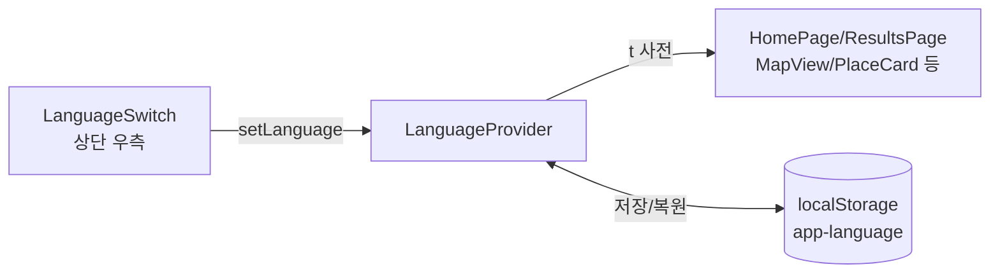
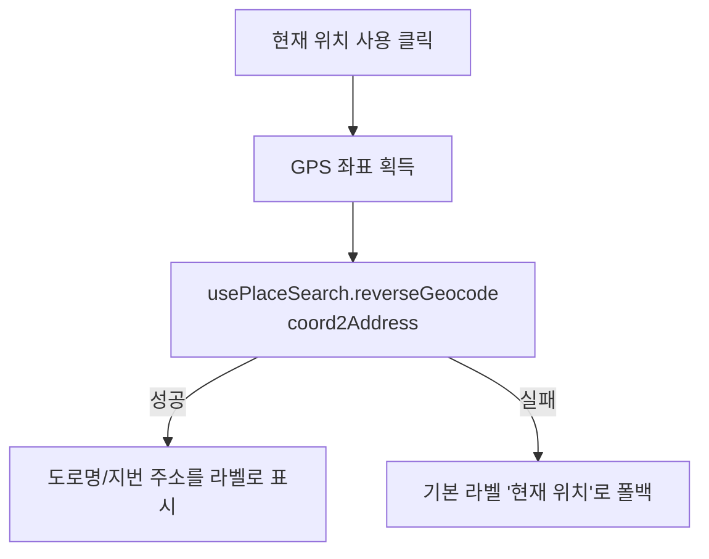

# 2026-07-10 08:xx 다국어(한/영/일) 지원 및 현재 위치 역지오코딩

## 작업 요약

- 프론트엔드에 한국어/영어/일본어 다국어(i18n)를 도입하고, 상단 우측에서 언어를 전환할 수 있는 UI를 추가했습니다. 기본 언어는 한국어입니다.
- "현재 위치 사용" 시 좌표만 쓰던 것을 카카오 역지오코딩으로 실제 주소 이름을 붙이도록 개선하고, 화면의 위/경도 좌표 표시를 소수점 1자리로 간소화했습니다.

## 변경 사항

### 다국어 지원

- `frontend/src/i18n/translations.ts`: 한/영/일 번역 사전. 동일한 키 집합을 세 언어가 공유.
- `frontend/src/i18n/LanguageContext.tsx`: `LanguageProvider` + `useI18n` 훅. 기본 언어 `ko`, 선택 언어는 `localStorage`(`app-language`)에 저장해 재방문 시 유지.
- `frontend/src/components/LanguageSwitch.tsx` / `.css`: 상단 우측 국기+라벨 선택 UI(좁은 화면에서는 국기만 표시).
- `frontend/src/main.tsx`: `LanguageProvider`로 앱 트리 감쌈.
- `HomePage.tsx`, `ResultsPage.tsx`, `MapView.tsx`, `PlaceCard.tsx`, `PlaceDetailModal.tsx`, `ResultControls.tsx`: 하드코딩된 한국어 문구를 번역 키로 교체.
- `HomePage.css`: 언어 스위치와 겹치지 않도록 테마 스위치 위치를 아래로 조정.
- 서버 데이터 값(장소명·카테고리·설명·LLM 결과)은 번역 대상에서 제외하고 UI 라벨만 번역.

### 현재 위치 역지오코딩 + 좌표 표시

- `frontend/src/hooks/usePlaceSearch.ts`: 좌표→주소 변환 `reverseGeocode`(카카오 `coord2Address`) 추가.
- `frontend/src/pages/HomePage.tsx`: "현재 위치 사용" 및 위치 미선택 상태의 자동 GPS 조회에 역지오코딩 라벨 적용, 위/경도 좌표를 `toFixed(1)`로 표시.
- `frontend/src/types/kakao-maps.d.ts`: `coord2Address` 및 결과 타입 정의 추가.

## 검증

- `npm run build`(tsc + vite build) 통과.

## 관련 커밋 해시

- `9bb31db` [frontend] 다국어(한/영/일) 지원 추가
- `1be3fd4` [frontend] 현재 위치 역지오코딩 및 좌표 표시 간소화
- (참고) `31b9d22` [frontend] 메인 화면 글래스모피즘 투명도 상향 — 별도 작업

## 다음 단계 / 남은 작업

- 브라우저 언어(`navigator.language`) 기반 최초 기본 언어 자동 감지는 미적용(현재는 항상 한국어 기본). 필요 시 후속 개선.
- 역지오코딩은 주소명을 사용하므로, 주변 대표 POI명(예: "OO역", "OO공원")을 우선 노출하는 방식은 후속 검토 대상.
