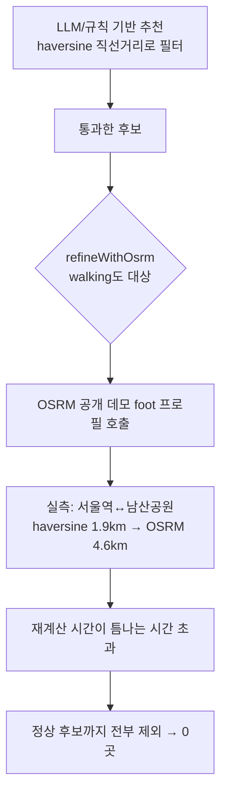

# 2026-07-10 09:14 도보 모드 추천 0곳 버그 수정

## 작업 요약

- 이동수단을 "도보"로 선택하면 서울역·전쟁기념관 등 어디서 시작해도 추천 장소가 하나도 안 나오는 버그를 해결했습니다.
- 원인은 OSRM 기반 거리 재보정(다른 개발자의 이전 작업)이 도보 모드에서 haversine 직선거리보다 훨씬 긴 우회 거리를 산출해, 틈나는 시간 필터에서 정상 후보까지 모두 걸러버린 것이었습니다.

## 원인 분석

OSRM 공개 데모 서버(`router.project-osrm.org`)의 `foot` 프로필을 실제로 호출해 확인한 결과:
- 서울역 → 남산공원: haversine 약 1.9km, OSRM 도보 거리 4.6km (약 2.4배)
- 도심 등산로·보행자 전용로를 인식하지 못하고 차도 기반으로 크게 우회하는 것으로 추정됨

60분 틈나는 시간(왕복 기준 편도 30분 = 약 1.8km 이내)처럼 짧은 구간일수록 이 배율 차이의 영향이 커서, 도보 모드는 거의 모든 조건에서 결과가 0곳이 되는 회귀가 발생했다.

## 변경 사항

- `backend/src/osrm.ts`: `OSRM_PROFILE`에서 `walking: 'foot'` 제거, `driving`만 유지. `isOsrmSupported`가 이제 driving에만 true를 반환
- `backend/src/recommendation.ts`: `refineWithOsrm` 주석을 도보 제외 이유(OSRM 데모 서버의 보행로 인식 한계, 실측치)로 갱신

## 검증

- 백엔드 `npm run build` 통과
- API 직접 호출: 서울역/90분/도보 → 이전 0곳 → 수정 후 2곳(서울역사박물관, 전쟁기념관) 정상 반환
- 60/90/120분 각각 확인: 2곳/3곳/4곳으로 시간 증가에 따라 결과도 증가하는 정상 패턴 확인
- 브라우저 E2E: 서울역/90분/도보 → 남산공원·백범광장·효창공원·전쟁기념관 4곳 정상 표시
- 원격에 병합된 다수의 프론트엔드 변경(i18n, MBTI, 해시태그 UI 등)과 충돌 없이 자동 병합, 빌드로 정합성 확인

## 관련 커밋 해시

- `bfcf1c3` [backend] 도보 모드에서 추천 0곳 나오는 버그 수정

## 참고

- driving은 OSRM 재보정을 계속 사용한다(차도는 OSRM이 정확하게 처리함이 기존 검증에서 확인됨).
- 도보 경로를 더 정확히 보정하려면 별도의 보행자 특화 라우팅 서비스(Kakao 등 자체 API) 도입이 필요하나, 이번 수정은 haversine 추정으로 되돌려 회귀만 해결했다.
