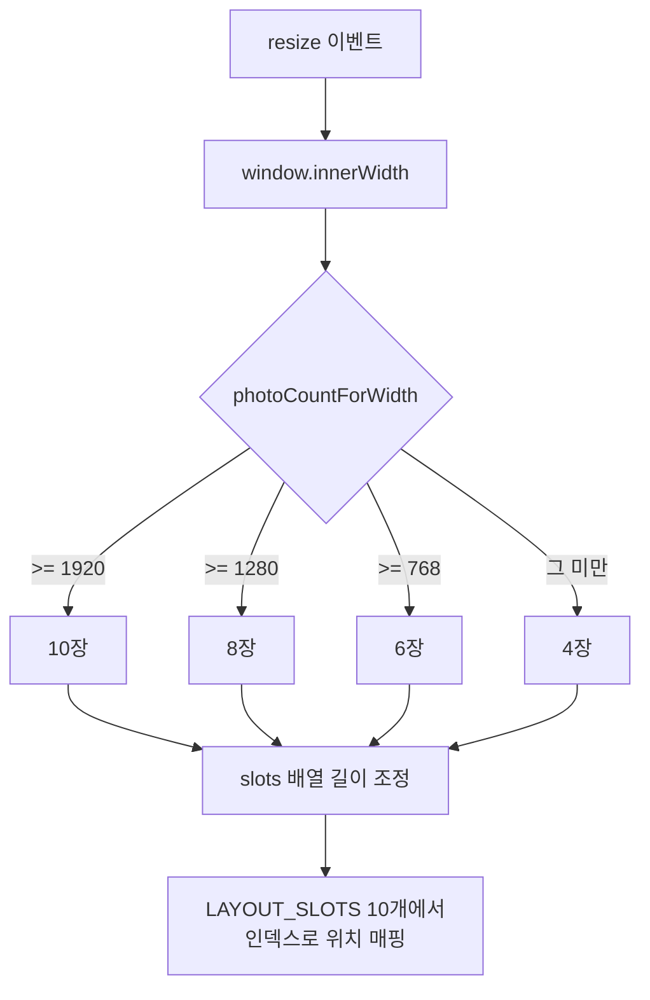

# 2026-07-10 09:28 배경 폴라로이드 사진 개수 반응형 처리

## 작업 요약

- 메인 배경에 흩뿌려지는 폴라로이드 사진 수를 화면 너비에 따라 동적으로 계산하도록 했습니다. 큰 화면일수록 더 많은 사진을 보여주고, 작은 화면에서는 최소 4장까지 줄여 과밀·성능 부담을 줄였습니다.
- 앞선 작업에서 배경 사진을 5장 → 8장으로 늘리고, 이동 수단 기본값을 대중교통 → 자동차로 바꾼 변경도 함께 기록합니다.

## 변경 사항

- `frontend/src/components/PolaroidBackdrop.tsx`
  - `photoCountForWidth(width)` 추가: FHD(1920+) 10장, 1280+ 8장, 768+ 6장, 그 미만 최소 4장
  - `LAYOUT_SLOTS`를 8개 → 10개로 확장(10장 표시 대응)
  - `resize` 이벤트를 감지해 창 크기 변경 시 `count`를 재계산하고, 슬롯 배열을 늘리거나 줄이도록 처리
  - `pickInitialSlots()` → `pickSlots(count)`로 변경해 초기 슬롯 수를 화면 크기에 맞게 생성
- `frontend/src/store/SearchContext.tsx`
  - 이동 수단 기본값을 `transit`(대중교통) → `driving`(자동차)로 변경

## 관련 커밋

- `b75a7b9` [frontend] 배경 폴라로이드 사진 개수 반응형 처리
- `40bcc8d` [frontend] 배경 폴라로이드 사진 8개로 확대
- `c488cd1` [frontend] 이동 수단 기본값 자동차로 변경
