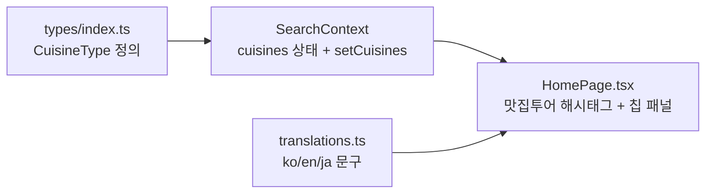

# 2026-07-10 09:30 맛집투어(음식 종류) 선택 필터 추가

## 작업 요약

- 메인 화면 검색 조건에 "맛집투어"(음식 종류) 해시태그와 선택 패널을 추가했습니다.
- MBTI/럭키데이와 마찬가지로 **선택 사항**이며, 음식 종류는 **여러 개 중복 선택**이 가능합니다.
- 한/영/일 3개 언어 문구를 모두 추가했습니다.

## 변경 사항

- `frontend/src/types/index.ts`
  - `CuisineType` 유니온 타입 추가: `korean | chinese | japanese | western | salad | coffee | dessert | snack`
- `frontend/src/store/SearchContext.tsx`
  - `cuisines: CuisineType[]` 상태와 `setCuisines` 액션 추가 (기본값 빈 배열, 중복 선택 지원)
- `frontend/src/pages/HomePage.tsx`
  - `CUISINE_OPTIONS`(아이콘 매핑), `CUISINE_LABELS`(i18n 라벨) 추가
  - `#맛집투어` 해시태그 버튼과 `cuisine` 패널 추가 (칩 토글 방식)
  - 히어로에 맛집투어 안내 문구(`home__foodtour`) 추가
- `frontend/src/i18n/translations.ts`
  - `homeFoodTour`, `hashtagCuisine`, `cuisinePanelLabel`, `cuisineGroupLabel`, `cuisineHint` 및 8종 음식 라벨을 ko/en/ja에 추가

## 관련 커밋

- (커밋 후 채워짐)
