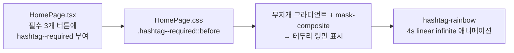

# 2026-07-10 09:35 필수 조건 해시태그 무지개 테두리 강조

## 작업 요약

- 메인 화면의 필수 입력 항목(위치·자투리 시간·이동수단) 해시태그 버튼 테두리에 무지개 빛이 도는 애니메이션을 추가해, 선택 항목(MBTI·맛집투어·럭키데이)과 시각적으로 구분되도록 했습니다.

## 변경 사항

- `frontend/src/pages/HomePage.tsx`
  - `#위치`, `#자투리`, `#이동수단` 해시태그 버튼에 `hashtag--required` 클래스 부여
- `frontend/src/pages/HomePage.css`
  - `.hashtag--required::before`에 무지개 그라디언트를 깔고 `mask-composite: exclude`로 테두리 링만 남김
  - `hashtag-rainbow` 키프레임(4초 루프)으로 무지개 색이 흐르도록 처리
  - `prefers-reduced-motion` 환경에서는 애니메이션 정지

## 참고

- 기존 강조(`hashtag--set` 주황 배경, `hashtag--open` 펼침 표시)와 함께 동작한다.

## 관련 커밋

- (커밋 후 채워짐)
