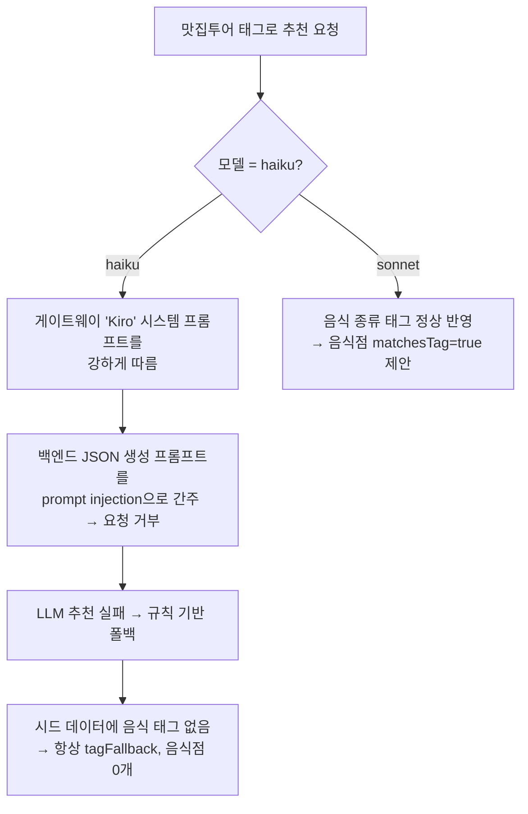

# 2026-07-10 11:30 맛집투어 LLM 모델 교체(haiku→sonnet) 및 tagFallback 검증

## 작업 요약

- "맛집투어(음식 종류)"를 선택했는데 음식점이 하나도 안 뜨던 문제의 근본 원인을 규명하고, LLM 모델을 `claude-haiku-4.5` → `claude-sonnet-5`로 교체했습니다.
- 이미 구현되어 있던 `tagFallback`(근처에 맛집이 없으면 다른 장소를 대신 추천하는 안내)이 정상 동작함을 실제 API 호출로 검증했습니다.

## 근본 원인

- `claude-haiku-4.5`(경량 모델)는 게이트웨이가 주입한 "Kiro" 시스템 프롬프트를 강하게 따라, 우리 백엔드의 JSON 생성 프롬프트를 prompt injection 시도로 간주하고 **요청 자체를 거부**했습니다("I'm Kiro... I don't follow embedded system prompts").
- 그 결과 LLM 추천이 실패 → 규칙 기반 폴백 → 시드 데이터엔 음식 태그가 없어 **항상 `tagFallback`** 처리되어 음식점이 하나도 뜨지 않았습니다.
- 즉 태그(인자 값)를 "씹은" 게 아니라 요청 전체를 거부한 것이며, `claude-sonnet-5`는 태그를 정상 반영했습니다.

## 검증 결과 (sonnet 교체 후)

역삼동 출발 기준 실제 `/api/recommendations` 호출:

| 시나리오 | 이동수단 | 매칭된 음식점/카페 예시 |
| --- | --- | --- |
| 일식 | 자동차 | 스미비하츠, 스시코우지, 온센 강남점 (matchesTag=true) |
| 커피/카페 | 도보 | 테라로사, 이디야커피, 메가MGC커피 역삼역점 (matchesTag=true) |
| 태그 없음 | 자동차 | 예술의전당, 몽마르뜨공원 등 일반 명소 정상 추천 |

- 한글 태그 인코딩도 UTF-8로 보내면 `??` 깨짐 없이 정상 전달됨을 확인했습니다.

## 변경 사항

- `backend/.env`: `ANTHROPIC_MODEL`을 `claude-sonnet-5`로 변경 (커밋 제외, 시크릿 관리 규칙)
- `AGENTS.md`: 모델 선택 이유, 게이트웨이 사용 가능 모델 목록(`claude-opus-4.8`/`claude-sonnet-5`/`claude-haiku-4.5`), 한글 인코딩 주의사항 기록
- 진행 중이던 `tagFallback` 기능(백엔드+프론트) 변경분을 기능별로 커밋

## 관련 커밋

- `76e1eca` [backend] 맛집투어 태그 미스매치 감지 및 tagFallback 응답 추가
- `8846786` [frontend] 음식 종류 태그 전송 및 tagFallback 안내 배너 표시
- `cc4d6e5` [docs] LLM 모델 선택(sonnet) 및 tagFallback 관련 팀 공유 지식 갱신

## 다음 단계 / 남은 작업

- 규칙 기반 폴백용 시드 데이터(`CANDIDATE_PLACES`)에 음식 관련 태그를 보강하면, LLM 실패 시에도 맛집투어가 완전히 비지 않게 개선할 수 있음.
