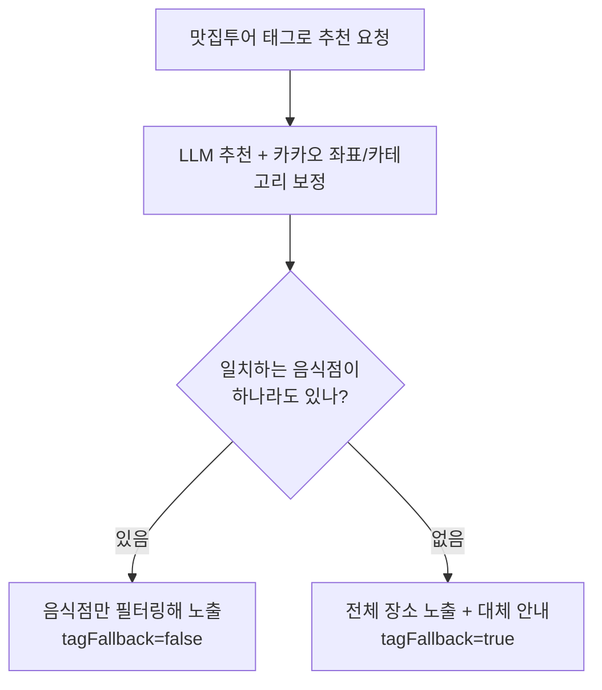

# 2026-07-10 11:58 맛집투어 태그 일치 시 음식점만 노출

## 작업 요약

- 맛집투어(음식 종류)를 선택하면 결과에 **음식점만** 보이도록 필터를 추가했습니다.
- 근처에 일치하는 음식점이 없을 때는 기존 동작(다른 장소 + 대체 안내)을 그대로 유지합니다.

## 동작 흐름

- `resolveLlmPlaces`에서 `matchesTagByCategory`로 음식 종류 일치 여부를 판정한 뒤, 태그 요청이 있고 일치 음식점이 존재하면 결과를 음식점으로 좁힌다.
- 일치 음식점이 없으면 상위(`recommendPlaces`)에서 `tagFallback=true`로 대체 안내를 띄운다.

## 검증 결과 (브라우저 실동작)

| 출발지 | 태그 | 결과 |
| --- | --- | --- |
| 강남역 2호선 | 일식 | 이태원숙이네닭발 강남점, 이자카야준 — **음식점만** 노출, 카테고리 필터도 "일식"만 표시 |
| 성남시 금토동 | 일식 | 근처 일식 음식점 없음 → "근처에 추천 음식점이 없어요. 대신 이런 장소는 어때요?" 안내 + 공원·쇼핑몰·카페거리 노출 |

- 백엔드 타입체크(`tsc --noEmit`) 통과.

## 변경 사항

- `backend/src/recommendation.ts`
  - `resolveLlmPlaces`: 태그 일치 음식점이 있으면 `unique.filter((p) => p.matchesTag)`로 결과를 음식점만으로 좁힘.

## 관련 커밋

- `bfc936f` [backend] 맛집투어 태그 일치 시 음식점만 노출
