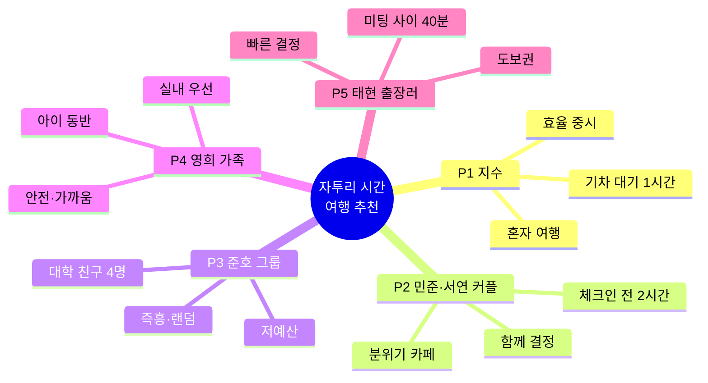

# 8. 사용자 페르소나 (User Personas)

> **이 문서의 역할**: "자투리 시간 여행 추천 웹앱"을 실제로 사용할 법한 대표 사용자 유형을 정의합니다. 기능 우선순위·UX 결정·카피라이팅의 기준으로 삼습니다.
> **함께 보는 문서**: 제품 개요·타깃 사용자는 [../product-requirements.md](../product-requirements.md) 1.4, 차별점은 [../planning/01-overview-differentiation.md](../planning/01-overview-differentiation.md) 참고.

---

## 페르소나 한눈에 보기

## 페르소나 비교표

| # | 페르소나 | 상황 | 가용 시간 | 이동수단 | 핵심 니즈 | 관련 기능 |
|---|----------|------|:---------:|:--------:|-----------|-----------|
| P1 | 혼행족 지수 | 기차 시간 대기 | 60분 | 도보 | 근처에서 빠르게 시간 때우기 | M-01·M-02·M-05·E-06 |
| P2 | 데이트 커플 민준·서연 | 숙소 체크인 전 | 120분 | 대중교통 | 둘이 갈 만한 분위기 좋은 곳 | M-04·M-08·E-01 |
| P3 | 대학생 그룹 준호 | 여행 중 애매한 낮 시간 | 90분 | 도보/대중교통 | 즉흥·저예산·다 같이 즐길 곳 | E-03·E-05·E-04 |
| P4 | 가족 여행 영희 | 아이 동반 오후 | 90분 | 자동차 | 안전하고 가까운 실내/실외 | M-03·E-01·E-06 |
| P5 | 출장러 태현 | 미팅 사이 짬 | 40분 | 도보 | 도보권에서 초고속 결정 | M-02·M-06·E-02 |

---

## P1 — 혼행족 지수 (Solo Traveler)

- **인적사항**
  - **이름/나이/성별**: 김지수 / 28세 / 여성
  - **직업/소득**: IT 스타트업 UX 디자이너, 연 5,000만 원대
  - **거주지**: 서울 마포구 원룸 거주, 지방 출장·여행 잦음
  - **가족/동반**: 미혼, 1인 여행 애호가(연 5~6회 국내 혼행)
  - **기기/앱 습관**: 아이폰 사용, 지도·리뷰 앱 능숙, 인스타 여행 기록 활발
  - **성향/가치관**: 계획형이지만 짧은 자투리는 즉흥 허용, "시간 낭비"를 특히 싫어함
  - **디지털 리터러시**: 상(높음) — 필터·조건 검색을 능숙하게 다룸
- **상황**: 낯선 도시에서 다음 기차까지 1시간이 붕 떴다. 무거운 캐리어 때문에 멀리는 못 간다.
- **목표**: 역에서 도보로 왕복 가능한 곳에서 커피 한 잔 하거나 전망 좋은 곳을 잠깐 보고 오기.
- **불편(Pain)**:
  - 지도 앱으로 하나하나 검색하면 "왕복하면 시간 안에 못 돌아오나?" 계산이 번거롭다.
  - 리뷰 많은 유명 관광지는 1시간에 다녀오기엔 부담.
- **우리 앱이 해결**: 가용 시간·도보 기준으로 **왕복 가능한 곳만** 필터링해 즉시 제시(M-06 이동시간 계산).
- **자주 쓸 기능**: GPS 위치(M-01), 시간 프리셋 60분(M-02), 상세·길찾기(E-06).

---

## P2 — 데이트 커플 민준·서연 (Couple)

- **인적사항**
  - **이름/나이/성별**: 이민준(27세·남성) · 박서연(26세·여성) 커플
  - **직업/소득**: 민준-중견기업 마케터, 서연-초등교사 / 합산 연 8,000만 원대
  - **거주지**: 경기 성남 각자 거주, 주말·연휴 국내 여행 즐김
  - **가족/동반**: 연애 2년 차, 항상 둘이 함께 이동·결정
  - **기기/앱 습관**: 둘 다 안드로이드, 감성 카페·포토스팟 SNS 검색이 습관
  - **성향/가치관**: "분위기·사진" 중시, 결정 미루는 경향(서로 양보) 있음
  - **디지털 리터러시**: 중상 — 지도·예약 앱 익숙, 복잡한 필터는 선호 안 함
- **상황**: 숙소 체크인 전 2시간. 짐을 맡기고 근처를 둘러보고 싶다.
- **목표**: 둘 다 좋아할 만한 감성 카페나 산책 코스를 찾아 함께 즐기기.
- **불편(Pain)**:
  - 서로 "아무거나 좋아"라며 결정을 미뤄 시간을 허비.
  - 날씨가 흐리면 실외 계획이 틀어짐.
- **우리 앱이 해결**: 취향 태그로 후보를 좁히고(M-04), 지도로 동선을 함께 보며(M-08) 빠르게 합의. 날씨 반영(E-01)으로 비 오면 실내 가중.
- **자주 쓸 기능**: 취향 태그(M-04), 지도 시각화(M-08), 이미지 카드 공유(E-04).

---

## P3 — 대학생 그룹 준호 (Friends Group)

- **인적사항**
  - **이름/나이/성별**: 최준호(22세·남성) 외 대학 동기 3명(21~23세, 남녀 혼성)
  - **직업/소득**: 대학교 3학년 재학생, 아르바이트·용돈 기반 저예산
  - **거주지**: 부산·대구 등 지방 캠퍼스, 방학마다 즉흥 국내 여행
  - **가족/동반**: 4인 그룹, 다수결·분위기로 결정
  - **기기/앱 습관**: 안드로이드·아이폰 혼재, 인스타·틱톡 릴스로 정보 소비, "밈·재미" 반응 좋음
  - **성향/가치관**: 즉흥·가성비·재미 최우선, 긴 검색·계획 싫어함
  - **디지털 리터러시**: 중 — 앱은 잘 쓰지만 여러 명이라 의견 조율이 핵심 병목
- **상황**: 여행 중 낮에 시간이 붕 떴다. 다들 "뭐 하지?"만 반복.
- **목표**: 돈 적게 들고 넷이 함께 웃으며 즐길 수 있는 즉흥 활동.
- **불편(Pain)**:
  - 여러 명 의견 조율이 어렵고, 결정이 안 남.
  - 예산 초과 장소가 섞여 나오면 곤란.
- **우리 앱이 해결**: 랜덤 뽑기 코스(E-03)로 "함께 뽑는" 재미, 예산 슬라이더(E-05)로 저예산 필터, 마음에 안 들면 재생성(E-02).
- **자주 쓸 기능**: 랜덤 뽑기(E-03), 예산 슬라이더(E-05), 공유(E-04).

---

## P4 — 가족 여행 영희 (Family)

- **인적사항**
  - **이름/나이/성별**: 정영희 / 38세 / 여성
  - **직업/소득**: 워킹맘(회사원), 배우자와 맞벌이 / 가구 연 9,000만 원대
  - **거주지**: 인천 아파트 거주, 자차 보유(가족 여행은 대부분 자동차)
  - **가족/동반**: 배우자 + 7세 자녀 동반, 실질 의사결정권자
  - **기기/앱 습관**: 아이폰, 육아·맘카페 정보 신뢰, 주차·화장실·수유실 정보 꼼꼼히 확인
  - **성향/가치관**: 안전·편의·가까움이 최우선, 실패 없는 "검증된 선택" 선호
  - **디지털 리터러시**: 중 — 익숙한 앱 위주 사용, 복잡한 설정보다 명확한 정보 제시 선호
- **상황**: 가족 여행 중 오후에 시간이 떠서 아이가 지루해한다.
- **목표**: 차로 금방 갈 수 있는, 아이가 좋아할 안전한 실내/실외 장소.
- **불편(Pain)**:
  - 이동이 길면 아이가 지침. 날씨·주차·편의시설 고려가 많음.
  - 어른 취향 위주 추천은 부적합.
- **우리 앱이 해결**: 자동차 이동수단(M-03)으로 도달 범위 계산, 날씨 반영(E-01)으로 우천 시 실내 우선, 상세 화면(E-06)에서 편의 정보 확인.
- **자주 쓸 기능**: 이동수단 선택(M-03), 날씨 반영(E-01), 상세/길찾기(E-06).

---

## P5 — 출장러 태현 (Business Traveler)

- **인적사항**
  - **이름/나이/성별**: 강태현 / 34세 / 남성
  - **직업/소득**: B2B 영업팀 과장, 연 7,000만 원대 + 출장 잦음(월 4~6회)
  - **거주지**: 대전 거주, 전국 각지로 당일 출장
  - **가족/동반**: 기혼(자녀 없음), 출장 중에는 항상 혼자
  - **기기/앱 습관**: 갤럭시 + 스마트워치, 캘린더·지도 알림에 의존, 결정은 초 단위로 빠르게
  - **성향/가치관**: 시간 엄수 강박, "제시간 복귀"가 최우선 — 고민할 여유 자체가 없음
  - **디지털 리터러시**: 상 — 앱 능숙하나, 상황상 원터치 수준의 즉시 추천을 원함
- **상황**: 미팅과 미팅 사이에 40분이 떴다. 근처를 벗어날 수 없다.
- **목표**: 도보 5~10분 내에서 커피를 마시거나 잠깐 걷고 정시에 복귀.
- **불편(Pain)**:
  - 늦으면 안 되므로 "왕복 시간 계산"이 스트레스.
  - 고민할 시간이 없어 빠른 단일 추천을 원함.
- **우리 앱이 해결**: 짧은 가용 시간(M-02) 입력 → 도보 왕복 가능 장소만(M-06), 마음에 안 들면 즉시 재추천(E-02).
- **자주 쓸 기능**: 시간 직접입력(M-02), 이동시간 계산(M-06), 재생성(E-02).

---

## 페르소나 → 기능 우선순위 시사점

| 시사점 | 근거 페르소나 | 대응 |
|--------|---------------|------|
| **왕복 시간 계산**은 거의 모든 유저의 핵심 불안 | P1·P5 | M-06을 MVP 최우선으로 |
| **빠른 단일 결정** 지원이 이탈을 줄임 | P1·P5 | 결과 상단에 대표 추천 강조 |
| **여러 명 합의**는 즉흥·공유로 푼다 | P2·P3 | E-03 뽑기, E-04 공유 강화 |
| **날씨·안전** 민감층 존재 | P2·P4 | E-01 날씨 반영 조기 확장 후보 |
| **저예산** 니즈 뚜렷 | P3 | E-05 예산 슬라이더 |
