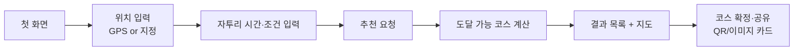

# PRD — 자투리 시간 여행 추천 웹앱

> **이 문서의 역할**: 제품 요구사항 정의서(Single Source of Truth). *무엇을·왜* 만드는지 — 제품 개요, 범위, 기술 스택, 역할 분담, API 계약, 단계별 계획, 리스크, 성공 지표를 정의합니다.
> **함께 보는 문서**: 실제 작업 진행 상황(*어디까지 했는가*)은 [task-checklist.md](task-checklist.md)의 체크리스트로 관리합니다. 기획 배경은 [planning/](planning/) 참고.
>
> 개요·기술 스택·역할 분담·API 계약·마일스톤은 **이 문서를 기준**으로 하며, task-checklist.md는 이를 중복 서술하지 않고 참조합니다.

---

## 1. 제품 개요

### 1.1 한 줄 콘셉트

여행지 현장에서 **지금 이 순간의 맥락(위치·시각·날씨·가용 시간)**을 읽어, 자투리 시간 안에 다녀올 수 있는 코스를 즉석에서 만들어 주는 웹 서비스.

### 1.2 해결하려는 문제

| # | 문제 | 우리의 해결 |
|---|------|-------------|
| 1 | 프롬프트만으로 여행을 짜면 날씨·시간·인원 같은 요소를 빠뜨림 | 입력 항목을 **구조화(선택형)**해 자동 반영 |
| 2 | 미리 만든 코스 선택이라 '지금·여기'와 안 맞음 | 현재 위치·시각·가용 시간 기준으로 **즉석 생성** |
| 3 | 여행 계획을 '혼자 짠다'는 느낌 | (확장) 친구와 함께 계획하는 협업 UX |

### 1.3 핵심 사용자 흐름



### 1.4 타깃 사용자

- 여행지에 도착했지만 다음 일정까지 애매하게 시간이 뜬 사람 (기차 시간 대기, 체크인 전 등)
- "1~3시간 정도 뭐 하지?"를 빠르게 해결하고 싶은 그룹/개인

---

## 2. 범위 (Scope)

해커톤 기간 내 완성도를 최우선으로, 기능을 3단계로 나눕니다.

### 2.1 MVP (반드시 완성 — Must Have)

| ID | 기능 | 설명 | 근거 |
|----|------|------|------|
| M-01 | 위치 입력 (GPS/지정) | 브라우저 Geolocation 또는 주소 검색으로 출발지 확정 | F-01 |
| M-02 | 자투리 시간 입력 | 슬라이더/프리셋(30·60·90분) + 직접 입력 | F-04 |
| M-03 | 이동수단 선택 | 도보 / 대중교통 / 자동차 | F-06 |
| M-04 | 취향 태그 선택 | 맛집·카페·자연·관광 등 다중 선택 | F-07 |
| M-05 | 코스/장소 추천 생성 | 입력 기반 도달 가능 장소 필터링 + 추천 | F-09 |
| M-06 | 이동시간 계산 | 출발지→각 장소 소요시간(편도/왕복 기준) | TASKS C |
| M-07 | 결과 목록 UI | 장소 카드(이름·카테고리·이동시간·거리·썸네일) | TASKS B |
| M-08 | 지도 시각화 | 사용자 위치 + 추천 장소 마커, 목록↔지도 연동 | F-09 |
| M-09 | 로딩/에러/결과없음 상태 | 3-state UX 처리 | TASKS |

### 2.2 확장 (시간 남으면 — Should Have)

| ID | 기능 | 설명 | 근거 |
|----|------|------|------|
| E-01 | 날씨 반영 | OpenWeatherMap으로 실내/실외 가중치 조정 | F-02, F-14 |
| E-02 | 대체 코스 재생성 | 마음에 안 들면 재추천/부분 교체 | F-13 |
| E-03 | 랜덤 뽑기 코스 | "뽑기" 버튼으로 즉흥 코스 | F-17 |
| E-04 | QR / 이미지 카드 공유 | 결과를 QR·티켓형 이미지로 공유 | F-10, F-19, F-22 |
| E-05 | 예산(짠내) 슬라이더 | 초저예산 모드 필터 | F-05, F-20 |
| E-06 | 상세 화면/모달 | 장소 상세 + 외부 지도 길찾기 링크 | TASKS B |

### 2.3 비범위 (이번엔 제외 — Won't Have)

- 실시간 영업시간 정확 반영(F-03/F-12): 데이터 확보 난제(유료 Google Places, 크롤링 법적 제약) → **데모에서는 정적 데이터/영업시간 없이 진행**
- 친구폰 실시간 협업(F-25), 음성 도슨트(F-28), URL 코스 생성(F-31) 등 Big Bet 항목
- 로그인/회원, DB 영구 저장, 결제, 다국어

### 2.4 기술 스택 (확정 제안)

| 영역 | 스택 |
|------|------|
| 프론트엔드 | React + TypeScript, Vite, 상태관리(Zustand), 스타일(Tailwind) |
| 지도 SDK | 카카오맵 (국내 데이터·무료 한도 유리) — 팀 협의로 최종 확정 |
| 백엔드 | Node.js + Express (TypeScript) |
| 외부 API | 지도/장소 검색 API, 길찾기(이동시간) API, (확장)OpenWeatherMap |
| 추천 로직 | 이동시간 기반 필터링 + 스코어링. (확장) LLM 코스 생성 |
| 배포 | FE: Vercel / BE: Render (또는 로컬 데모) |

> 지도/길찾기 API는 **셋업 단계에서 반드시 하나로 확정**해야 이후 병렬 작업이 가능합니다.

---

## 3. API 계약 (Contract) — 병렬 작업의 기준

프론트(2명)와 백엔드(1명)가 대기 없이 병렬로 진행하려면 **이 계약을 셋업 단계에서 먼저 확정**하고, FE는 Mock 응답으로 개발을 시작합니다.

### 3.1 추천 요청 `POST /api/recommendations`

```json
{
  "location": { "lat": 37.5665, "lng": 126.9780 },
  "availableMinutes": 90,
  "mode": "driving",
  "tags": ["cafe", "nature"],
  "tripType": "roundtrip"
}
```

| 필드 | 타입 | 필수 | 설명 |
|------|------|:---:|------|
| location | `{lat, lng}` | O | 출발지 좌표 |
| availableMinutes | number | O | 자투리 시간(분) |
| mode | `walking\|transit\|driving` | O | 이동수단 |
| tags | string[] | X | 취향 태그 |
| tripType | `oneway\|roundtrip` | X | 편도/왕복 (기본 roundtrip) |

### 3.2 추천 응답

```json
{
  "places": [
    {
      "id": "p1",
      "name": "남산공원",
      "category": "공원",
      "lat": 37.5512,
      "lng": 126.9882,
      "travelMinutes": 20,
      "distanceKm": 5.2,
      "thumbnail": "https://...",
      "description": "..."
    }
  ]
}
```

### 3.3 에러 응답 규격

```json
{ "error": { "code": "INVALID_INPUT", "message": "availableMinutes는 필수입니다." } }
```

| code | 상황 |
|------|------|
| `INVALID_INPUT` | 필수값 누락/범위 초과 |
| `NO_RESULT` | 도달 가능 장소 없음 |
| `UPSTREAM_ERROR` | 외부 API 오류 |

---

## 4. 역할 분담 & 병렬 작업 전략 (개발자 3명)

| 담당 | 역할 | 핵심 책임 |
|------|------|-----------|
| **개발자 A** | FE — 입력 & 첫 화면 | 랜딩, 위치/시간/조건 입력, GPS, 상태관리, API 호출 |
| **개발자 B** | FE — 결과 & 지도 | 결과 목록, 지도 시각화, 상세, 반응형 |
| **개발자 C** | BE — API & 추천 로직 | 서버, 외부 API 연동, 이동시간 계산, 추천 알고리즘 |

**병렬화 핵심 원칙**
- 셋업 단계에서 **API 계약(3장)과 지도 API를 먼저 확정** → 이후 3명이 독립적으로 진행.
- **A/B는 Mock 응답**(계약 기반 고정 JSON)으로 개발, **C는 실제 로직**을 개발 → 연동 단계에서 합류.
- A와 B는 **입력 화면 / 결과 화면**으로 화면 자체가 분리되어 있어 동시 작업 시 충돌이 적음.
- 공유 타입 정의(`types/`)를 계약 기준으로 먼저 만들어 FE/BE가 함께 참조.

---

## 5. 단계별 구현 계획 (Phased Implementation)

각 Phase는 **완료 기준(Exit Criteria)**을 가지며, 병렬 작업 구간을 명시합니다.

### Phase 0 — 셋업 & 합의 (전원 함께) 🔴 선행 필수

> 이 단계는 병렬 아님. 셋이 함께 합의해야 이후가 풀립니다.

- [ ] 저장소 구조 확정 (monorepo 권장: `apps/web`, `apps/api`, `packages/types`)
- [ ] 지도/길찾기 API 확정 (카카오/네이버/구글 택1) + API 키 발급
- [ ] **API 계약(3장) 확정** 및 공유 타입 정의 작성
- [ ] 브랜치 전략·커밋 컨벤션·리뷰 규칙 합의
- [ ] `.env` / API 키 관리 방식 합의 (키는 커밋 금지)
- [ ] 각자 프로젝트 스캐폴딩 (FE Vite, BE Express)

**완료 기준**: 3명이 각자 로컬에서 빈 앱을 실행 가능. Mock API 계약 문서 확정.

---

### Phase 1 — 핵심 기능 병렬 개발 🟢 (A / B / C 동시 진행)

세 명이 **동시에** 아래를 진행합니다.

#### 개발자 A — 입력 화면
- [ ] 랜딩 레이아웃 + 라우팅(입력→결과)
- [ ] GPS 현재 위치 가져오기(`navigator.geolocation`) + 권한 거부 예외 UI
- [ ] 지정 위치 입력(주소/장소 검색 자동완성)
- [ ] 자투리 시간 입력(슬라이더/프리셋/직접입력)
- [ ] 이동수단 선택 + 취향 태그 선택
- [ ] 입력값 유효성 검증
- [ ] 전역 상태관리(Zustand) 세팅
- [ ] 추천 요청 API 호출 + 로딩/에러 처리 (**Mock 응답 기준**)

#### 개발자 B — 결과 화면 & 지도
- [ ] 결과 목록 레이아웃 + 장소 카드 컴포넌트
- [ ] 정렬/필터(이동시간순·거리순·카테고리)
- [ ] 결과없음/로딩/에러 상태 UI
- [ ] 지도 SDK 통합 + 사용자·장소 마커 표시
- [ ] 마커 클릭 InfoWindow + 목록↔지도 연동(hover/클릭 강조)
- [ ] **Mock 데이터**로 화면 완성

#### 개발자 C — 백엔드 & 추천 로직
- [ ] 서버 초기화 + 라우팅/에러 핸들링 미들웨어 + CORS/로깅
- [ ] 지도/장소 검색 API 연동(주변 후보 조회)
- [ ] 길찾기/이동시간 API 연동(출발지→각 장소)
- [ ] `POST /api/recommendations` 구현
- [ ] **자투리 시간 내 도달 가능 필터링**(편도/왕복 기준 정의)
- [ ] 추천 스코어링(이동시간·거리 가중치)
- [ ] 입력 유효성 검증 + 에러 응답 규격화

**완료 기준**: A/B는 Mock으로 전체 화면 흐름 시연 가능. C는 실제 요청→응답이 계약대로 동작.

---

### Phase 2 — 연동 & 통합 🟡 (전원, 일부 병렬)

- [ ] FE의 Mock을 실제 API로 교체 (A 주도, C 지원)
- [ ] FE ↔ BE 통합 (CORS·에러 코드·필드 매핑 점검)
- [ ] 실제 데이터로 지도·목록 렌더링 확인 (B)
- [ ] 주요 시나리오 E2E: GPS 추천 / 지정 위치 추천 / 시간대별
- [ ] 예외 케이스: 위치 실패, 결과 없음(`NO_RESULT`), API 오류(`UPSTREAM_ERROR`)

**완료 기준**: Mock 없이 실제 API로 핵심 흐름(입력→추천→지도)이 끊김 없이 동작.

---

### Phase 3 — 확장 기능 병렬 🟢 (여유 시 A/B/C 분담)

시간이 남으면 2.2의 확장 기능을 아래처럼 나눠 병렬 진행.

- [ ] **A**: 예산(짠내) 슬라이더(E-05), 랜덤 뽑기 버튼(E-03) 입력 연동
- [ ] **B**: QR/이미지 카드 공유(E-04), 장소 상세 모달(E-06)
- [ ] **C**: 날씨 반영(E-01), 대체 코스 재생성(E-02)

**완료 기준**: 각 확장 기능이 독립적으로 토글/동작. 미완성 기능은 feature flag로 숨김.

---

### Phase 4 — 마무리 & 데모 (전원)

- [ ] 반응형(모바일 우선) 점검 (B)
- [ ] 접근성(ARIA·키보드) 점검 (B)
- [ ] 추천 로직 단위 테스트 핵심 케이스 (C)
- [ ] 성능 점검(응답 속도·지도 렌더링)
- [ ] 배포 + API 키 보안 확인 + 데모 시나리오 리허설

**완료 기준**: 배포 URL에서 데모 시나리오가 재현 가능.

---

## 6. 마일스톤 요약

| Phase | 목표 | 병렬 여부 |
|-------|------|-----------|
| 0. 셋업 | 저장소·API·계약·타입 확정 | 함께(선행) |
| 1. 핵심 | A 입력 / B 결과·지도 / C 추천 API (Mock 병렬) | **3인 병렬** |
| 2. 연동 | 실제 API 연결, FE-BE 통합 | 함께 |
| 3. 확장 | 날씨·재생성·공유·예산 등 | **3인 병렬** |
| 4. 마무리 | 반응형·테스트·배포·데모 | 함께 |

---

## 7. 리스크 & 대응

| 리스크 | 영향 | 대응 |
|--------|------|------|
| 실시간 영업시간 데이터 확보 어려움 | 현장성 차별점 약화 | MVP에서 제외, 정적 데이터로 데모 |
| 지도 API 무료 한도/키 이슈 | 개발 지연 | Phase 0에서 키 발급·한도 확인, 대안 SDK 후보 준비 |
| 길찾기 API 비용/속도 | 추천 지연 | 후보 수 제한 + 응답 캐싱 |
| API 계약 변경 | FE/BE 재작업 | 계약을 Phase 0에 고정, 변경 시 전원 합의 |
| 개인정보 처리 | 요건 미충족 | 로그인 없음 + 세션 데이터 미저장 원칙 유지 |

---

## 8. 성공 지표 (데모 기준)

- 위치 + 시간 입력부터 추천 결과까지 **끊김 없이 3초 내** 표시
- GPS 추천 / 지정 위치 추천 두 시나리오 모두 동작
- 지도에서 추천 장소 확인 및 목록↔지도 연동 동작
- 결과없음·오류 등 예외 상황에서 앱이 깨지지 않음
