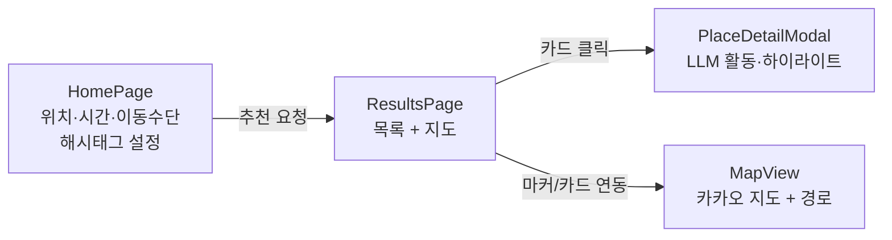

# Frontend — 자투리 시간 여행 추천 웹앱

React + TypeScript + Vite 기반 프론트엔드. 위치·자투리 시간·이동수단을 입력받아 백엔드 추천 API를 호출하고, 결과를 카카오 지도와 목록으로 보여준다.

## 실행

```bash
npm install
npm run dev       # http://localhost:5173/
npm run build     # 타입 체크 + 프로덕션 빌드
npm run preview   # 빌드 결과 미리보기
npm run lint      # Oxlint
```

> Vite 포트는 `vite.config.ts`에서 `5173` + `strictPort`로 고정돼 있다. 카카오 지도 SDK는 콘솔에 등록된 도메인(`http://localhost:5173`)에서만 로드되므로 포트가 바뀌면 지도가 뜨지 않는다.

## 환경변수

`.env.example` 을 `.env` 로 복사해 사용한다 (키는 커밋 금지).

| 변수 | 설명 |
|------|------|
| `VITE_API_BASE_URL` | 백엔드 API 주소. 비어 있으면 Mock 추천 데이터로 동작 |
| `VITE_KAKAO_MAP_KEY` | 카카오 지도 JavaScript 키. 없으면 지도 없이 목록만 동작 |

> `VITE_` 접두사 변수는 브라우저에 노출되므로, 지도 JavaScript 키처럼 노출돼도 되는 값만 둔다. Claude/카카오 REST 키는 백엔드에만 둔다.

## 화면 흐름



## 구조

```
src/
  main.tsx / App.tsx     # 진입점 + 라우팅
  pages/
    HomePage.tsx         # 입력 화면 (해시태그 기반 설정, MBTI/럭키데이 선택 옵션)
    ResultsPage.tsx      # 결과 목록 + 지도
  components/
    MapView.tsx          # 카카오 지도 (마커, 경로, 목록↔지도 연동)
    PlaceCard.tsx        # 장소 카드
    ResultControls.tsx   # 정렬/필터
    PlaceDetailModal.tsx # 장소 상세 (LLM 활동·하이라이트)
    PolaroidBackdrop.tsx # 첫 화면 폴라로이드 배경 콜라주
  hooks/
    useGeolocation.ts    # GPS 현재 위치
    useKakaoLoader.ts    # 카카오 SDK 로드
    usePlaceSearch.ts    # 장소 검색 자동완성
  api/
    recommendations.ts   # POST /api/recommendations (+ Mock 폴백)
    route.ts             # GET /api/route
    placeDetail.ts       # GET /api/place-detail
  store/                 # 전역 상태 (SearchContext)
  config/settings.ts     # 앱 설정 (테마/글래스모피즘)
  types/index.ts         # 공용 타입 (API 계약 기준)
```

## 백엔드 연동

`.env`에 `VITE_API_BASE_URL=http://localhost:4000` 을 설정하면 Mock 대신 실제 백엔드를 호출한다. 백엔드 실행은 [backend/README.md](../backend/README.md) 참고. 백엔드 에러 계약(`NO_RESULT`(404)→빈 결과, `INVALID_INPUT`(400) 등)을 파싱한다.
